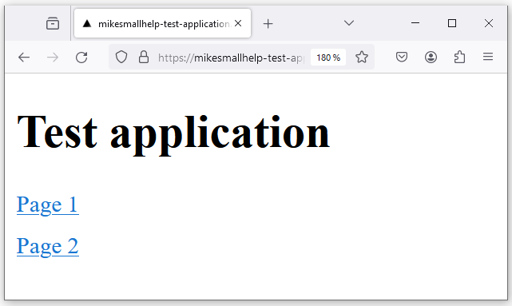

# wacat - Tests your web application against cat chaos!

Imagine, you leave your computer for a while and go to pick up a cup of coffee. Meanwhile, your cat walks over your keyboard and causes some chaos. 

wacat (walking cat) application for example:

- goes to your web application root url
- visits every link in your application
- adds random inputs to form inputs
- selects values from dropdown menus
- clicks on every button

Additionally, wacat

- detects HTTP errors (for example HTTP 500 errors) between browser and server
- detects error strings from the web pages
  - you give error strings in a parameter file
- can read form inputs from external files (for example from resources like https://github.com/0xspade/Combined-Wordlists?tab=readme-ov-file)
- supports some authentication scenarios
  - you give authentication configuration in a JSON file

wacat uses the [Playwright](https://playwright.dev/) tool internally.

Please note wacat is still under construction. Please create a new issue, if you find a bug or some particular feature is needed.

## Limitations

- tested only with Linux (Ubuntu 20.04.6 LTS)
- not working with Windows, possibly support will come end of february 
- not tested with Mac

## Warnings

Please test only your own web application or have a permit for testing someone else's application. Testing someone else's application's vulnerabilites without permit could be illegal. 

Application is designed not go outside of the host you are testing. But as this is my hobby project everything is possible and it's good to follow what the wacat application is doing and use ctrl + c if it goes to wrong page. Please also note that if your application uses authentication and your wacat authentication configuration is not correct or wacat is not working for your case, then your account could be locked or something like that. Also wacat could mess your applications's database etc. So it's good to test only in the test environment.

## Installation

### Install Node.js

[Install Node.js from here](https://nodejs.org/en)

### Clone wacat and install it

Clone the wacat repository, go to the wacat folder and run:

```
npm install && npx playwright install --with-deps && npm run build && npm i -g
```

Note: probably your password is asked, when you run previous command, because the Playwright tool is installed globally.

## Running

### Basic running

Run the command in the wacat folder:

```
wacat test <your url>
```

For example a command:

```
wacat test https://mikesmallhelp-test-application.vercel.app/
```
tests a simple application in the url https://mikesmallhelp-test-application.vercel.app/. The application have pages:




First the wacat application opens the Chromium browser and goes to the root URL, which was given for the command: 


The root page doesn't contain any input fields, dropdown menus or buttons. wacat simple collects links of the two sub pages and goes to them. In the sub pages wacat fills the form inputs and selects from the dropdown menus. Finally it pushes the buttons in the each sub page. Here is the command, which you can copy, paste and run. Same way you can run all other examples and use my test applications.

```
wacat test https://mikesmallhelp-test-application.vercel.app/
```
```
Testing in url: https://mikesmallhelp-test-application.vercel.app/. Please wait...

Running 1 test using 1 worker
[chromium] › test.spec.ts:30:1 › test an application
In the page: https://mikesmallhelp-test-application.vercel.app/
In the page: https://mikesmallhelp-test-application.vercel.app/working-page
Fill the #0 input field a value: elq4npt0
#0 drop-down list. Select the option #1
Push the button #0
In the page: https://mikesmallhelp-test-application.vercel.app/working-page2
Fill the #0 input field a value: b8wzde2s
#0 drop-down list. Select the option #1
Push the button #0
  1 passed (7.4s)

```
Note that output contains "1 passed" so wacat didn't find any errors in the application.

### Detect HTTP errors

wacat can detect HTTP errors between browser and server. For example if the button in the example application below is pushed the HTTP 500 error occurs.


An example about this is:

```
wacat test https://mikesmallhelp-test-application-http-500-error.vercel.app/
```
```
Testing in url: https://mikesmallhelp-test-application-http-500-error.vercel.app/. Please wait...
undefined
 ›   Error: Error occurred: Command failed: ROOT_URL='https://mikesmallhelp-test-application-http-500-error.vercel.app/' npx playwright test --project=chromium
 ›    + stderr:  + stdout: 
 ›   Running 1 test using 1 worker
     [chromium] › test.spec.ts:29:1 › test an application
 ›   In the page: https://mikesmallhelp-test-application-http-500-error.vercel.app/
     In the page: https://mikesmallhelp-test-application-http-500-error.vercel.app/working-page
     Fill the #0 input field a value: 33g4z1kv
     #0 drop-down list. Select the option #1
     Push the button #0
     In the page: https://mikesmallhelp-test-application-http-500-error.vercel.app/api-returns-http-500
     Fill the #0 input field a value: 78nyp02h
     #0 drop-down list. Select the option #1
     Push the button #0
     Request to https://mikesmallhelp-test-application-http-500-error.vercel.app/api/http-500 resulted in status code 500
       1) [chromium] › test.spec.ts:29:1 › test an application ──────────────────────────────────────────
 ›   
 ›       AssertionError: Request to https://mikesmallhelp-test-application-http-500-error.vercel.app/api/http-500 resulted in status code 500
 ›
 ›         37 |         if (status >= 400) {
 ›         38 |             console.log(`Request to ${url} resulted in status code ${status}`);
 ›       > 39 |             fail(`Request to ${url} resulted in status code ${status}`);
 ›            |             ^
 ›         40 |         }
 ›         41 |     });
 ›         42 |
 ›
 ›           at Page.<anonymous> (/home/lenovo/projektit/wacat/e2e-tests/test.spec.ts:39:13)
 ›
       1 failed
 ›       [chromium] › test.spec.ts:29:1 › test an application

```

So wacat detects HTTP 500 error, prints the error log with the text "1 failed" and stops the execution.

### Detect error strings from a target application's pages

Here is an example application, which contains in one sub page an error text "Error occurred!":


We configure in our example that "Error occurred!" is detected by wacat. We want also that the error text "abc" is detected. We configure this in JSON file like this:

```
{
    "errorTexts": ["abc", "Error occurred!"]
}
```
The run command (--conf flag is used to pass the JSON file) for Windows is:

```
wacat test --conf example-files\configuration-error-texts.json https://mikesmallhelp-test-application-error-in-page.vercel.app
```
The run command for Linux is:

```
wacat test --conf example-files/configuration-error-texts.json https://mikesmallhelp-test-application-error-in-page.vercel.app
```

The command output is:

```
Testing in url: https://mikesmallhelp-test-application-error-in-page.vercel.app. Please wait...
undefined
 ›   Error: Error occurred: Command failed: ROOT_URL='https://mikesmallhelp-test-application-error-in-page.vercel.app' AUTHENTICATION_CONFIGURATION_FILE_PATH=example-files/configuration-error-texts.json
 ›    npx playwright test --project=chromium
 ›    + stderr:  + stdout: 
 ›   Running 1 test using 1 worker
     [chromium] › test.spec.ts:29:1 › test an application
 ›   In the page: https://mikesmallhelp-test-application-error-in-page.vercel.app/
     Check the page not contain the abc text
     Check the page not contain the Error occurred! text
     In the page: https://mikesmallhelp-test-application-error-in-page.vercel.app/working-page
     Check the page not contain the abc text
     Check the page not contain the Error occurred! text
     Fill the #0 input field a value: 4eqhz14r
     #0 drop-down list. Select the option #1
     Push the button #0
     Check the page not contain the abc text
     Check the page not contain the Error occurred! text
     In the page: https://mikesmallhelp-test-application-error-in-page.vercel.app/error-text-in-page
     Check the page not contain the abc text
     Check the page not contain the Error occurred! text
       1) [chromium] › test.spec.ts:29:1 › test an application ──────────────────────────────────────────
 ›   
 ›       Error: expect(received).not.toContain(expected) // indexOf
 ›
 ›       Expected substring: not "Error occurred!"
 ›       Received string:        "Test page - error-text-in-pageError occurred!{\"props\":{\"pageProps\":{}},\"page\":\"/error-text-in-page\",\"query\":{},\"buildId\":\"qQ0wdj-2mwRrndTkG4FBO\",\"nextExp
 ›   ort\":true,\"autoExport\":true,\"isFallback\":false,\"scriptLoader\":[]}"
 ›
 ›          96 |     for (const errorText of configuration.errorTexts) {
 ›          97 |         console.log(`Check the page not contain the ${errorText} text`);
 ›       >  98 |         expect(content).not.toContain(errorText);
 ›             |                             ^
 ›          99 |     }
 ›         100 | }
 ›         101 |
 ›
 ›           at checkPageForErrors (/home/lenovo/projektit/wacat/e2e-tests/test.spec.ts:98:29)
 ›           at handlePage (/home/lenovo/projektit/wacat/e2e-tests/test.spec.ts:84:5)
 ›           at visitLinks (/home/lenovo/projektit/wacat/e2e-tests/test.spec.ts:154:13)
 ›           at handlePage (/home/lenovo/projektit/wacat/e2e-tests/test.spec.ts:86:5)
 ›           at /home/lenovo/projektit/wacat/e2e-tests/test.spec.ts:47:5
 ›
       1 failed
 ›       [chromium] › test.spec.ts:29:1 › test an application
```

So wacat detects "Error occurred!" text in one sub page, reports error with a "1 failed" text and execution stops.

### Read input field texts from the file

Normally wacat fills the form input fields with the random strings. It is possible to read input fields from the file, for example from the file example-files/input.texts, which contents are:

```
xaxa
ybyb
```
wacat uses each input text from the file for the each input field in the target application. The run command is for a local file in Windows:

```
wacat test --input-texts example-files\input-texts.txt https://mikesmallhelp-test-application.vercel.app/ 
```

and in Linux:

```
wacat test --input-texts example-files/input-texts.txt https://mikesmallhelp-test-application.vercel.app/ 
```

and for the remote file:

```
wacat test --input-texts https://raw.githubusercontent.com/mikesmallhelp/wacat/main/example-files/input-texts.txt https://mikesmallhelp-test-application.vercel.app/
```

All commands should output following:

```
Testing in url: https://mikesmallhelp-test-application.vercel.app/. Please wait...

Running 1 test using 1 worker
[chromium] › test.spec.ts:29:1 › test an application
In the page: https://mikesmallhelp-test-application.vercel.app/
In the page: https://mikesmallhelp-test-application.vercel.app/working-page
Fill the #0 input field a value: xaxa
#0 drop-down list. Select the option #1
Push the button #0
Fill the #0 input field a value: ybyb
#0 drop-down list. Select the option #1
Push the button #0
In the page: https://mikesmallhelp-test-application.vercel.app/working-page2
Fill the #0 input field a value: xaxa
#0 drop-down list. Select the option #1
Push the button #0
Fill the #0 input field a value: ybyb
#0 drop-down list. Select the option #1
Push the button #0
  1 passed (22.9s)
```

In the output you can see that values from the input-texts.txt file are used. You can use for the testing different input text files, for example from the page https://github.com/0xspade/Combined-Wordlists?tab=readme-ov-file. But please note that currently wacat doesn't support very long files, maybe there is some memory problem. But you can currently split too long files and test like that.

## Do authencation

Here is an application with a simple authentication


wacat can do authentication to this application with the following JSON file:

```

{
    "authentication": {
        "usernameLabel": "Username",
        "usernameValue": "Mike",
        "passwordLabel": "Password",
        "passwordValue": "Smallhelp",
        "loginButtonLabel": "Login"
    }
}

```

Note for example that the application contains "Username" label and this is put into the "usernameLabel" attribute's value in the JSON. The username value is "Mike", which is put into the "usernameValue" attribute's value in the JSON. And same logic applies for the password input field. The application has a button named "Login", which is put into the "loginButtonLabel" attribute's value in the JSON.

The example run command for Windows is:

```
wacat test --conf example-files\configuration-authentication.json https://mikesmallhelp-test-application-simple-authentication.vercel.app/
```

The run command for Linux is:

```
wacat test --conf example-files/configuration-authentication.json https://mikesmallhelp-test-application-simple-authentication.vercel.app/
```

The command output is:

```
Testing in url: https://mikesmallhelp-test-application-simple-authentication.vercel.app/. Please wait...

Running 1 test using 1 worker
[chromium] › test.spec.ts:29:1 › test an application
Filled the username and the password. Pushed the authentication button
In the page: https://mikesmallhelp-test-application-simple-authentication.vercel.app/
In the page: https://mikesmallhelp-test-application-simple-authentication.vercel.app/working-page
Fill the #0 input field a value: 5yzn4z93
#0 drop-down list. Select the option #1
Push the button #0
In the page: https://mikesmallhelp-test-application-simple-authentication.vercel.app/working-page2
Fill the #0 input field a value: 5zl4fvk4
#0 drop-down list. Select the option #1
Push the button #0
  1 passed (19.4s)

```

Note in the output the text "Filled the username and the password. Pushed the authentication button", this means that wacat did the authentication.

### Do more complicated authentication

Here is an application with a more complicated authentication


wacat can do authentication to this application with the following JSON file:

```

{
    "authentication": {
        "beforeAuthenticationLinkTexts": [
            "Please go to an application",
            "Please login"
        ],
        "usernameLabel": "Username",
        "usernameValue": "Mike",
        "usernameButtonLabel": "Next",
        "passwordLabel": "Password",
        "passwordValue": "Smallhelp",
        "loginButtonLabel": "Login"
    }
}

```

The JSON is more complicated than in previous example. Is has "beforeAuthenticationLinkTexts" attribute, which contains the link texts "Please go to an application" and "Please login", which are in the pages before the authentication page. The application has button "Next" in the page where username is given. The "Next" value is given into the "usernameButtonLabel" JSON attribute's value.

The example run command for Windows is:

```
wacat test --conf example-files\configuration-complicated-authentication.json https://mikesmallhelp-test-application-more-complicated-authentication.vercel.app/
```
The run command for Linux is:

```
wacat test --conf example-files/configuration-complicated-authentication.json https://mikesmallhelp-test-application-more-complicated-authentication.vercel.app/
```

The command output is:

```
Testing in url: https://mikesmallhelp-test-application-more-complicated-authentication.vercel.app/. Please wait...

Running 1 test using 1 worker
[chromium] › test.spec.ts:29:1 › test an application
Filled the username and the password. Pushed the authentication button
In the page: https://mikesmallhelp-test-application-more-complicated-authentication.vercel.app/
In the page: https://mikesmallhelp-test-application-more-complicated-authentication.vercel.app/logout
In the page: https://mikesmallhelp-test-application-more-complicated-authentication.vercel.app/working-page
Fill the #0 input field a value: if324rll
#0 drop-down list. Select the option #1
Push the button #0
In the page: https://mikesmallhelp-test-application-more-complicated-authentication.vercel.app/working-page2
Fill the #0 input field a value: k1fqcdhg
#0 drop-down list. Select the option #1
Push the button #0
  1 passed (24.5s)
```

### Configure pages, which are not visited

wacat is designed so that it should not go outside of the host you are testing. You can also configure more page urls, which are not visited.

Look in the previous example

```
In the page: https://mikesmallhelp-test-application-more-complicated-authentication.vercel.app/logout
```

If you don't want to go into the logout page, add the "notVisitLinkUrls" attribute into the JSON. It contains the urls, which are not visited. An example JSON is:

```
{
    "authentication": {
        "beforeAuthenticationLinkTexts": [
            "Please go to an application",
            "Please login"
        ],
        "usernameLabel": "Username",
        "usernameValue": "Mike",
        "usernameButtonLabel": "Next",
        "passwordLabel": "Password",
        "passwordValue": "Smallhelp",
        "loginButtonLabel": "Login"
    },
    "notVisitLinkUrls": [
        "https://mikesmallhelp-test-application-more-complicated-authentication.vercel.app/logout"
    ]
}
```

The example run command for Windows is:

```
wacat test --conf example-files/configuration-complicated-authentication-with-not-visit-link-urls-remote.json https://mikesmallhelp-test-application-more-complicated-authentication.vercel.app/
```

The run command for Linux is:

```
wacat test --conf example-files/configuration-complicated-authentication-with-not-visit-link-urls-remote.json https://mikesmallhelp-test-application-more-complicated-authentication.vercel.app/
```

The command output is:

```
Testing in url: https://mikesmallhelp-test-application-more-complicated-authentication.vercel.app/. Please wait...

Running 1 test using 1 worker
[chromium] › test.spec.ts:29:1 › test an application
Filled the username and the password. Pushed the authentication button
In the page: https://mikesmallhelp-test-application-more-complicated-authentication.vercel.app/
In the page: https://mikesmallhelp-test-application-more-complicated-authentication.vercel.app/working-page
Fill the #0 input field a value: k825ikgw
#0 drop-down list. Select the option #1
Push the button #0
In the page: https://mikesmallhelp-test-application-more-complicated-authentication.vercel.app/working-page2
Fill the #0 input field a value: 5okrd0c6
#0 drop-down list. Select the option #1
Push the button #0
  1 passed (21.4s)
```

Note now there are not the line:

```
In the page: https://mikesmallhelp-test-application-more-complicated-authentication.vercel.app/logout
```

in the output.

## Developing wacat

### Technologies

wacat technology stack is simple:

- Typescript
- Bash script
- oclif, The Open CLI Framework
- Playwright
- Next.js for the test applications

### Developing

Do your changes and run

```
npm run test && npm run build && npm install -g && ./run-tests.sh
```

## Contributions

Contributions are warmly welcome. Look for the issues page. Please create a new issue, if you find a bug or some particular feature is needed.

Please note: If you add a new feature, add a test case for that. Please look `run-tests.sh` file. Please consider also adding unit tests.


