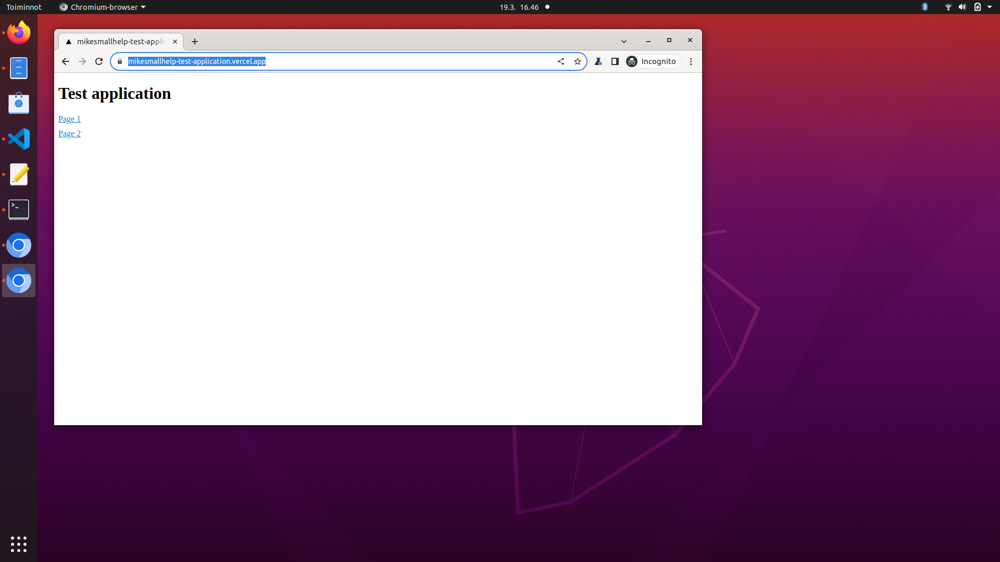

# wacat - Challenge Your Web App with AI-Driven Cat Chaos!

Imagine, you leave your computer for a while and go to pick up a cup of coffee. Meanwhile, your cat walks over your keyboard and causes some chaos. 

wacat (walking cat) application

- Navigates to the root URL of your web application
- Visits every link in your application in a random order
- Inputs random text into forms
- Selects random values from dropdown menus, checkboxes, etc
- Clicks every button in a random order

Additionally, wacat:

- Detects error messages on web pages using AI
  - This is an optional feature and requires an OpenAI API key
- Detects HTTP errors (e.g., HTTP 500 errors) between the browser and server
- Detects errors in the browser's console log
- Detects user-defined error messages on web pages
  - These error messages are specified in a parameter file
- Supports user-defined configurations for random form text inputs
- Can read form inputs from external files (e.g., resources like [Combined-Wordlists](<https://github.com/0xspade/Combined-Wordlists?tab=readme-ov-file)>))
- Can focus exclusively on testing links, which is useful for smoke testing your application
- Supports some authentication scenarios
  - Authentication configurations are provided in a JSON file
- Allows configuration of pages that should not be visited
- Supports a headless mode
- Allows configuration of page download wait times and overall test timeout values
- Supports running in CI pipelines

## Technical details

wacat uses the Playwright tool internally. It is tested to work on Windows, Linux, and Mac.

## Reporting bugs and requesting features

If you encounter a bug or need a specific feature, please create a new issue.

## Current Version

The current version of wacat is 1.2.0. Please refer to the end of this page for the change history.

## Warnings
Please ensure you only test your own web application or have explicit permission to test someone else’s application. Testing the vulnerabilities of an application without authorization could be illegal.

The application is designed to stay within the host you are testing. However, as this is a hobby project, unexpected behavior is possible. It's important to monitor wacat's actions and use Ctrl + C to stop the process if it navigates to an unintended page.

Additionally, if your application requires authentication and your wacat authentication configuration is incorrect or incompatible, it could lead to issues such as account lockouts. wacat could also potentially disrupt your application's database or other components. For these reasons, it is strongly recommended to use wacat only in a testing environment.

## Installation

### Install Node.js

[Install Node.js from here](https://nodejs.org/en)

### Clone wacat and install it

Clone the wacat repository, navigate to the wacat folder, and run the following command:

```
npm install && npx playwright install --with-deps && npm run build && npm i -g
```

Note: You may be prompted for your password when running the above command, as the Playwright tool is installed globally.

### Optional: Add OpenAI API Key

If you want to use AI for error detection (see details below), add your OpenAI API key and model to a .env file:

```
OPENAI_API_KEY=<your key here>
OPENAI_API_MODEL=<your model here>
```

Important: Providing an OpenAI API key will result in charges from OpenAI for API usage. While wacat has been thoroughly tested, please be aware that programming errors could lead to a higher-than-expected number of calls to the OpenAI API.

You can also add the following optional environment variable to the .env file:

```
MAX_PAGE_CONTENT_CHARS=<your value here>
```

This value sets the maximum number of characters sent to the OpenAI API for error detection. The default is 3000 if not specified. See additional details below.

### Updating wacat

To update wacat to the latest version, run:

```
git pull && npm install && npx playwright install --with-deps && npm run build && npm i -g
```

## Running

### Basic usage

Run the following command in the wacat folder:

```
wacat test <your url>
```

For example, the command:

```
wacat test https://mikesmallhelp-test-application.vercel.app/
```
tests a simple application at the URL https://mikesmallhelp-test-application.vercel.app/. The application includes the following pages:


First, the wacat application opens the Chromium browser and navigates to the root URL provided in the command: 



The root page does not contain any input fields, dropdown menus, or similar elements. wacat simply collects links to the two subpages and visits them. On each subpage, wacat performs the following actions:

1. Presses the button
2. Fills the form fields, selects options from dropdown menus, etc.
3. Presses the button again

Here is the command for you to copy, paste, and run. You can follow the same process to run all other examples. Feel free to experiment with the provided test applications.

```
wacat test https://mikesmallhelp-test-application.vercel.app/
```
```
Testing in url: https://mikesmallhelp-test-application.vercel.app/. Please wait...


Running 1 test using 1 worker
[chromium] › test.spec.ts:41:1 › test an application
In the page: https://mikesmallhelp-test-application.vercel.app/
In the page: https://mikesmallhelp-test-application.vercel.app/working-page2
Push the button #1
Filling the #1 text input field a value: _k6AKNU3z"{=myqS.K
The label is 'Your Date of Birth Here', so generating an appropriate random content for the input field
Filling the #2 text input field a value: 16/09/2004
The #1 drop-down list. Selecting the option #2
Selecting the #1 checkbox
The #1 radio button group. Selecting the radio button #3
Filling the #1 email input field a value: pvcgigtju.nwntltbk@uqimkbwwiz.com
Filling the #1 password input field a value: A#1!!a#!#AaA!A
Filling the #1 search input field a value: SZOmqATkrV
Filling the #1 url input field a value: https://nrebn.com
Push the button #1
In the page: https://mikesmallhelp-test-application.vercel.app/working-page
Push the button #1
Filling the #1 text input field a value: _k6AKNU3z"{=myqS.K
The label is 'Your Date of Birth Here', so generating an appropriate random content for the input field
Filling the #2 text input field a value: 16/09/2004
The #1 drop-down list. Selecting the option #2
Selecting the #1 checkbox
The #1 radio button group. Selecting the radio button #2
Filling the #1 email input field a value: uxxdxqcjhq.mhettm@ukyefgvdsk.gov
Filling the #1 password input field a value: aa2B#1aA!##2A#!AaA
Filling the #1 search input field a value: lSjsBVOzkhCC
Filling the #1 url input field a value: https://vpo7ut.net
Push the button #1
  1 passed (24.3s)
```
Note: The default wait time for each page is 5000 milliseconds. To adjust this wait time, use the --wait flag (see details later).

### Optional: Detect errors on the page with AI

Here is an example application that contains an error message, "An unexpected error occurred! Please try again after some time," on one of its subpages:


If you provide an OpenAI API key (see above), wacat can use AI to detect error messages like this on the page.

For example, run the command:

```
wacat test https://mikesmallhelp-test-application-error-in-page.vercel.app/
```

The command output might look like this:

```
Testing in url: https://mikesmallhelp-test-application-error-in-page.vercel.app/. Please wait...

 ›   Error: 
 ›   Error occurred: Command failed: ROOT_URL='https://mikesmallhelp-test-application-error-in-page.vercel.app/' npx playwright test --project=chromium --headed
 ›    + stderr:  + stdout: 
 ›   Running 1 test using 1 worker
     [chromium] › test.spec.ts:45:1 › test an application
 ›   In the page: https://mikesmallhelp-test-application-error-in-page.vercel.app/
     Check with the AI that the page doesn't contain errors.
     In the page: https://mikesmallhelp-test-application-error-in-page.vercel.app/working-page
     Check with the AI that the page doesn't contain errors.
     Push the button #1
     Check with the AI that the page doesn't contain errors.
     Filling the #1 text input field a value: AyXoEJ_Sd$(7+JqeROkD
     The #1 drop-down list. Selecting the option #2
     Push the button #1
     Check with the AI that the page doesn't contain errors.
     In the page: https://mikesmallhelp-test-application-error-in-page.vercel.app/error-text-in-page
     Check with the AI that the page doesn't contain errors.
       1) [chromium] › test.spec.ts:45:1 › test an application ──────────────────────────────────────────
 ›   
 ›       AssertionError: The AI detected that current page contains error, the page contents are: Test page An unexpected error occurred! Please try again after some time.
 ›
 ›         162 |                 console.log(errorMessage);
 ›         163 |             } else {
 ›       > 164 |                 fail(errorMessage);
 ›             |                 ^
 ›         165 |             }
 ›         166 |         }
 ›         167 |     }
 ›
 ›           at checkPageForErrors (/home/lenovo/projektit/wacat/e2e-tests/test.spec.ts:164:17)
 ›           at handlePage (/home/lenovo/projektit/wacat/e2e-tests/test.spec.ts:127:5)
 ›           at visitLinks (/home/lenovo/projektit/wacat/e2e-tests/test.spec.ts:507:13)
 ›           at handlePage (/home/lenovo/projektit/wacat/e2e-tests/test.spec.ts:137:5)
 ›           at /home/lenovo/projektit/wacat/e2e-tests/test.spec.ts:78:5
 ›
       1 failed
 ›       [chromium] › test.spec.ts:45:1 › test an application ───────────────────────────────────────────

```

When wacat uses AI, it logs the message:

```
Check with the AI that the page doesn't contain errors.
``` 

for every page.

If the AI detects an error, wacat logs a message like:

```
The AI detected that current page contains error, the page contents are: Test page An unexpected error occurred! Please try again after some time.
```

To log AI errors without halting the test, use the --bypass-ai-errors flag. For example:

```
wacat test --bypass-ai-errors https://mikesmallhelp-test-application-error-in-page.vercel.app/
```

#### Handling OpenAI API rate limits

The OpenAI API has rate limits based on your organization's subscription. For example, if you see an error like this:

```
Error: 429 Rate limit reached for *** in organization 
 ›   ************ on requests per min (RPM): Limit 3, Used 3, 
 ›   Requested 1. Please try again in 20s.
```

use the --wait parameter (as explained below) to slow down wacat's requests. You may also need to adjust the test timeout using the --timeout parameter (as explained below).

For daily request limits, such as:

```
Error: 429 Rate limit reached for *** in organization 
 ›   ************ on requests per day (RPD): Limit 200, Used 
 ›   200, Requested 1. Please try again in 7m12s.
```

wait for the limit to reset, and then rerun wacat.

#### Managing OpenAI token usage
If your queries exceed the API's tokens-per-minute limit, you can use the MAX_PAGE_CONTENT_CHARS variable to control the number of characters wacat sends per page to the API for analysis.

The base prompt contains approximately 1600 characters. For example, if you set MAX_PAGE_CONTENT_CHARS to 400, the total prompt size will be around 2000 characters, or roughly 500 tokens (1 token is approximately 4 characters in English). The response will always consist of a single token, so primarily manage the prompt size.

For more details, refer to https://help.openai.com/en/articles/4936856-what-are-tokens-and-how-to-count-them.

### Detect HTTP errors

wacat can detect HTTP errors occurring between the browser and the server. For example, in the application shown below, clicking the button triggers an HTTP 500 error:


You can test this scenario with the following command:

```
wacat test https://mikesmallhelp-test-application-http-500-error.vercel.app/
```
The command output might look like this:
```
Testing in url: https://mikesmallhelp-test-application-http-500-error.vercel.app/. Please wait...

 ›   Error: 
 ›   Error occurred: Command failed: ROOT_URL='https://mikesmallhelp-test-application-http-500-error.vercel.app/' npx playwright test --project=chromium --headed
 ›    + stderr:  + stdout: 
 ›   Running 1 test using 1 worker
     [chromium] › test.spec.ts:40:1 › test an application
 ›   In the page: https://mikesmallhelp-test-application-http-500-error.vercel.app/
     In the page: https://mikesmallhelp-test-application-http-500-error.vercel.app/working-page
     Push the button #1
     Filling the #1 text input field a value: 4trK*edD
     The #1 drop-down list. Selecting the option #2
     Push the button #1
     In the page: https://mikesmallhelp-test-application-http-500-error.vercel.app/api-returns-http-500
     Push the button #1
     In the page: https://mikesmallhelp-test-application-http-500-error.vercel.app/api-returns-http-500: Request to https://mikesmallhelp-test-application-http-500-error.vercel.app/api/http-500 resulted
 ›    in status code 500
     In the page: https://mikesmallhelp-test-application-http-500-error.vercel.app/api-returns-http-500: Found an error message in the browser's console: Failed to load resource: the server responded 
 ›   with a status of 500 ()
     In the page: https://mikesmallhelp-test-application-http-500-error.vercel.app/api-returns-http-500: Found an error message in the browser's console: Error fetching data: Error: Network response was
 ›    not ok
 ›       at r (https://mikesmallhelp-test-application-http-500-error.vercel.app/_next/static/chunks/pages/api-returns-http-500-d6a108dd102494f7.js:1:1402)
 ›       at async n (https://mikesmallhelp-test-application-http-500-error.vercel.app/_next/static/chunks/pages/api-returns-http-500-d6a108dd102494f7.js:1:735)
       1) [chromium] › test.spec.ts:40:1 › test an application ──────────────────────────────────────────
 ›   
 ›       AssertionError: In the page: https://mikesmallhelp-test-application-http-500-error.vercel.app/api-returns-http-500: Request to 
 ›   https://mikesmallhelp-test-application-http-500-error.vercel.app/api/http-500 resulted in status code 500
 ›
 ›         51 |
 ›         52 |             if (!bypassHttpErrors) {
 ›       > 53 |                 fail(message);
 ›            |                 ^
 ›         54 |             }
 ›         55 |         }
 ›         56 |     });
 ›
 ›           at Page.<anonymous> (/home/lenovo/projektit/wacat/e2e-tests/test.spec.ts:53:17)
 ›
       1 failed
 ›       [chromium] › test.spec.ts:40:1 › test an application

```

In this example, wacat detects the HTTP 500 error, logs it with "1 failed," and stops execution. The specific error message is:

```
AssertionError: In the page: https://mikesmallhelp-test-application-http-500-error.vercel.app/api-returns-http-500: Request to 
 ›   https://mikesmallhelp-test-application-http-500-error.vercel.app/api/http-500 resulted in status code 500
```

#### Continuing execution despite HTTP errors

To prevent wacat from stopping execution on HTTP errors, use the --bypass-http-errors flag. For example:

```
wacat test --bypass-http-errors https://mikesmallhelp-test-application-http-500-error.vercel.app/
```

In this case, wacat logs the HTTP 500 error but continues the test execution without stopping.

### Detect error strings from a target application's pages

Here is an example application where one subpage contains the error text: 

```
An unexpected error occurred! Please try again after some time.
```


In this example, we configure wacat to detect the error text "An unexpected error occurred! Please try again after some time." We also want wacat to detect the error text "abc". This configuration is added to a JSON file as follows:

```
{
    "errorTextsInPages": ["abc", "An unexpected error occurred! Please try again after some time."]
}
```
The run command to use this JSON configuration file (via the --conf flag) is as follows:

#### For Windows:

```
wacat test --conf example-files\configuration-error-texts.json https://mikesmallhelp-test-application-error-in-page.vercel.app
```

#### For Linux and Mac:

```
wacat test --conf example-files/configuration-error-texts.json https://mikesmallhelp-test-application-error-in-page.vercel.app
```

The command output is:

```
Testing in url: https://mikesmallhelp-test-application-error-in-page.vercel.app. Please wait...

 »   Error:
 »   Error occurred: Command failed: set ROOT_URL=https://mikesmallhelp-test-application-error-in-page.vercel.app && set CONFIGURATION_FILE_PATH=example-files\configuration-error-texts.json && npx playwright test --project=chromium
 »   --headed
 »    + stderr:  + stdout:
 »   Running 1 test using 1 worker
     [chromium] › test.spec.ts:45:1 › test an application
 »   In the page: https://mikesmallhelp-test-application-error-in-page.vercel.app/
     Check that the page doesn't contain the abc text
     Check that the page doesn't contain the An unexpected error occurred! Please try again after some time. text
     In the page: https://mikesmallhelp-test-application-error-in-page.vercel.app/error-text-in-page
     Check that the page doesn't contain the abc text
     Check that the page doesn't contain the An unexpected error occurred! Please try again after some time. text
       1) [chromium] › test.spec.ts:45:1 › test an application ──────────────────────────────────────────
 »
 »       Error: expect(received).not.toContain(expected) // indexOf
 »
 »       Expected substring: not "An unexpected error occurred! Please try again after some time."
 »       Received string:        "Test page An unexpected error occurred! Please try again after some time."
 »
 »         177 |     for (const errorText of configuration.errorTextsInPages) {
 »         178 |         console.log(`Check that the page doesn't contain the ${errorText} text`);
 »       > 179 |         expect(content).not.toContain(errorText);
 »             |                             ^
 »         180 |     }
 »         181 | }
 »         182 |
 »
 »           at checkPageForErrors (C:\repot\wacat\e2e-tests\test.spec.ts:179:29)
 »           at handlePage (C:\repot\wacat\e2e-tests\test.spec.ts:127:5)
 »           at visitLinks (C:\repot\wacat\e2e-tests\test.spec.ts:507:13)
 »           at handlePage (C:\repot\wacat\e2e-tests\test.spec.ts:137:5)
 »           at C:\repot\wacat\e2e-tests\test.spec.ts:78:5
 »
       1 failed
 »       [chromium] › test.spec.ts:45:1 › test an application ───────────────────────────────────────────
```

In this scenario, wacat detects the error text "An unexpected error occurred! Please try again after some time." on one subpage. It reports the error with the message "1 failed" and halts execution.

### Detect errors in the browser's console

Here is an example application that logs an error in the browser's console:


When the following command is run:

```
wacat test https://mikesmallhelp-test-application-error-in-browser-console.vercel.app
```

the execution stops when an error is detected in the browser's console:

```
Testing in url: https://mikesmallhelp-test-application-error-in-browser-console.vercel.app. Please wait...

 ›   Error: 
 ›   Error occurred: Command failed: ROOT_URL='https://mikesmallhelp-test-application-error-in-browser-console.vercel.app' WAIT=2000 npx playwright test --project=chromium --headed
 ›    + stderr:  + stdout: 
 ›   Running 1 test using 1 worker
     [chromium] › test.spec.ts:40:1 › test an application
 ›   In the page: https://mikesmallhelp-test-application-error-in-browser-console.vercel.app/
     In the page: https://mikesmallhelp-test-application-error-in-browser-console.vercel.app/working-page
     Push the button #1
     Filling the #1 text input field a value: q52<<r`k`bZzP<Jua#53RAn)cKg0&K14
     The #1 drop-down list. Selecting the option #2
     Push the button #1
     In the page: https://mikesmallhelp-test-application-error-in-browser-console.vercel.app/error-in-browser-console: Found an error message in the browser's console: Hello! Something wrong!
       1) [chromium] › test.spec.ts:40:1 › test an application ──────────────────────────────────────────
 ›   
 ›       AssertionError: In the page: https://mikesmallhelp-test-application-error-in-browser-console.vercel.app/error-in-browser-console: Found an error message in the browser's console: Hello! 
 ›   Something wrong!
 ›
 ›         62 |
 ›         63 |             if (!bypassBrowserConsoleErrors && !bypassHttpErrors) {
 ›       > 64 |                 fail(message);
 ›            |                 ^
 ›         65 |             }
 ›         66 |         }
 ›         67 |     });
 ›
 ›           at Page.<anonymous> (/home/lenovo/projektit/wacat/e2e-tests/test.spec.ts:64:17)
 ›
       1 failed
 ›       [chromium] › test.spec.ts:40:1 › test an application
```
In this example, wacat logs the message: 

```
Found an error message in the browser's console: Hello! Something wrong!
```

and stops execution.

#### Bypassing browser console error checks

If you want wacat to bypass this check and continue execution despite browser console errors, use the --bypass-browser-console-errors flag. For example:

```
wacat test --bypass-browser-console-errors https://mikesmallhelp-test-application-error-in-browser-console.vercel.app
```

In this case, wacat logs the error message but does not stop execution, continuing the test instead.

### Configure the random form inputs

Normally wacat creates random form inputs. By default the length is something between 1 and 60 characters and a default character set is used. Give the min length with the flag --random-input-texts-min-length and the max length with the flag --random-input-texts-max-length. Give the character set with the flag --random-input-texts-charset. The example command and output is:

```
wacat test --random-input-texts-min-length 1 --random-input-texts-max-length 3 --random-input-texts-charset ®©¥¬¿ https://mikesmallhelp-test-application.vercel.app/
```

```
Testing in url: https://mikesmallhelp-test-application.vercel.app/. Please wait...


Running 1 test using 1 worker
[chromium] › test.spec.ts:41:1 › test an application
In the page: https://mikesmallhelp-test-application.vercel.app/
In the page: https://mikesmallhelp-test-application.vercel.app/working-page
Push the button #1
Filling the #1 text input field a value: ®
Filling the #2 text input field a value: ®
Filling the #3 text input field a value: ®
Filling the #4 text input field a value: ®
Filling the #5 text input field a value: ®
Filling the #6 text input field a value: ®
The #1 drop-down list. Selecting the option #2
Selecting the #1 checkbox
The #1 radio button group. Selecting the radio button #3
Push the button #1
In the page: https://mikesmallhelp-test-application.vercel.app/working-page2
Push the button #1
Filling the #1 text input field a value: ®
Filling the #2 text input field a value: ®
Filling the #3 text input field a value: ®
Filling the #4 text input field a value: ®
Filling the #5 text input field a value: ®
Filling the #6 text input field a value: ®
The #1 drop-down list. Selecting the option #2
Selecting the #1 checkbox
The #1 radio button group. Selecting the radio button #2
Push the button #1
  1 passed (54.0s)
```

In this example wacat generates random string ```®```, which lenght is between 1 and 3 characters and it's from the given character set ```®©¥¬¿```. 

### Read input field texts from the file

Additionally is possible to read input fields from the file, for example from the file example-files/input.texts, which contents are:

```
xaxa
ybyb
```
wacat uses each input text from the file for the each input field in the target application unless there happens some error or page changes. The run command is for the local file in Windows:

```
wacat test --input-texts example-files\input-texts.txt https://mikesmallhelp-test-application.vercel.app/ 
```

and in Linux and Mac:

```
wacat test --input-texts example-files/input-texts.txt https://mikesmallhelp-test-application.vercel.app/ 
```

and for the remote file:

```
wacat test --input-texts https://raw.githubusercontent.com/mikesmallhelp/wacat/main/example-files/input-texts.txt https://mikesmallhelp-test-application.vercel.app/
```

All commands should output following:

```
Testing in url: https://mikesmallhelp-test-application.vercel.app/. Please wait...

Running 1 test using 1 worker
[chromium] › test.spec.ts:41:1 › test an application
In the page: https://mikesmallhelp-test-application.vercel.app/
In the page: https://mikesmallhelp-test-application.vercel.app/working-page
Push the button #1
Filling the #1 text input field a value: xaxa
Filling the #2 text input field a value: xaxa
Filling the #3 text input field a value: xaxa
Filling the #4 text input field a value: xaxa
Filling the #5 text input field a value: xaxa
Filling the #6 text input field a value: xaxa
The #1 drop-down list. Selecting the option #2
Selecting the #1 checkbox
The #1 radio button group. Selecting the radio button #3
Push the button #1
Filling the #1 text input field a value: ybyb
Filling the #2 text input field a value: ybyb
Filling the #3 text input field a value: ybyb
Filling the #4 text input field a value: ybyb
Filling the #5 text input field a value: ybyb
Filling the #6 text input field a value: ybyb
The #1 drop-down list. Selecting the option #2
Selecting the #1 checkbox
The #1 radio button group. Selecting the radio button #1
Push the button #1
In the page: https://mikesmallhelp-test-application.vercel.app/working-page2
Push the button #1
Filling the #1 text input field a value: xaxa
Filling the #2 text input field a value: xaxa
Filling the #3 text input field a value: xaxa
Filling the #4 text input field a value: xaxa
Filling the #5 text input field a value: xaxa
Filling the #6 text input field a value: xaxa
The #1 drop-down list. Selecting the option #2
Selecting the #1 checkbox
The #1 radio button group. Selecting the radio button #1
Push the button #1
Filling the #1 text input field a value: ybyb
Filling the #2 text input field a value: ybyb
Filling the #3 text input field a value: ybyb
Filling the #4 text input field a value: ybyb
Filling the #5 text input field a value: ybyb
Filling the #6 text input field a value: ybyb
The #1 drop-down list. Selecting the option #2
Selecting the #1 checkbox
The #1 radio button group. Selecting the radio button #3
Push the button #1
  1 passed (1.1m)
```

In the output you can see that values from the input-texts.txt file are used. You can use for the testing different input text files, for example from the page https://github.com/0xspade/Combined-Wordlists?tab=readme-ov-file. When you use a big input text file, use --timeout parameter (see below) with enough big value. Tested with 5000 lines input text file against a simple test application.

## Test only links

To test only links in the application use a ```--only-links``` flag. Then wacat loads pages and detects HTTP errors, but input fields are not filled etc. An example command and output are:

```
wacat test --only-links https://mikesmallhelp-test-application.vercel.app/
```
```
Testing in url: https://mikesmallhelp-test-application.vercel.app/. Please wait...


Running 1 test using 1 worker
[chromium] › test.spec.ts:40:1 › test an application
In the page: https://mikesmallhelp-test-application.vercel.app/
In the page: https://mikesmallhelp-test-application.vercel.app/working-page
In the page: https://mikesmallhelp-test-application.vercel.app/working-page2
  1 passed (14.7s)
```

## Do authencation

Here is an application with a simple authentication


wacat can do authentication to this application with the following JSON file:

```

{
    "authentication": {
        "usernameLabel": "Username",
        "usernameValue": "Mike",
        "passwordLabel": "Password",
        "passwordValue": "Smallhelp",
        "loginButtonLabel": "Login"
    }
}

```

Note for example that the application contains "Username" label and this is put into the "usernameLabel" attribute's value in the JSON. The username value is "Mike", which is put into the "usernameValue" attribute's value in the JSON. And same logic applies for the password input field. The application has a button named "Login", which is put into the "loginButtonLabel" attribute's value in the JSON.

The example run command for Windows is:

```
wacat test --conf example-files\configuration-authentication.json https://mikesmallhelp-test-application-simple-authentication.vercel.app/
```

The run command for Linux and Mac is:

```
wacat test --conf example-files/configuration-authentication.json https://mikesmallhelp-test-application-simple-authentication.vercel.app/
```

The command output is:

```
Testing in url: https://mikesmallhelp-test-application-simple-authentication.vercel.app/. Please wait...


Running 1 test using 1 worker
[chromium] › test.spec.ts:40:1 › test an application
Filled the username and the password. Pushed the authentication button
In the page: https://mikesmallhelp-test-application-simple-authentication.vercel.app/
In the page: https://mikesmallhelp-test-application-simple-authentication.vercel.app/working-page2
Push the button #1
Filling the #1 text input field a value: =_e6PF[J{u98&QI`DP
The #1 drop-down list. Selecting the option #2
Push the button #1
In the page: https://mikesmallhelp-test-application-simple-authentication.vercel.app/working-page
Push the button #1
Filling the #1 text input field a value: =_e6PF[J{u98&QI`DP
The #1 drop-down list. Selecting the option #2
Push the button #1
  1 passed (24.7s)
```

Note in the output the text "Filled the username and the password. Pushed the authentication button", this means that wacat did the authentication.

### Do more complicated authentication

Here is an application with a more complicated authentication


wacat can do authentication to this application with the following JSON file:

```

{
    "authentication": {
        "beforeAuthenticationLinkTexts": [
            "Please go to an application",
            "Please login"
        ],
        "usernameLabel": "Username",
        "usernameValue": "Mike",
        "usernameButtonLabel": "Next",
        "passwordLabel": "Password",
        "passwordValue": "Smallhelp",
        "loginButtonLabel": "Login"
    }
}

```

The JSON is more complicated than in previous example. Is has "beforeAuthenticationLinkTexts" attribute, which contains the link texts "Please go to an application" and "Please login", which are in the pages before the authentication page. The application has button "Next" in the page where username is given. The "Next" value is given into the "usernameButtonLabel" JSON attribute's value.

The example run command for Windows is:

```
wacat test --conf example-files\configuration-complicated-authentication.json https://mikesmallhelp-test-application-more-complicated-authentication.vercel.app/
```
The run command for Linux and Mac is:

```
wacat test --conf example-files/configuration-complicated-authentication.json https://mikesmallhelp-test-application-more-complicated-authentication.vercel.app/
```

The command output is:

```
Testing in url: https://mikesmallhelp-test-application-more-complicated-authentication.vercel.app/. Please wait...


Running 1 test using 1 worker
[chromium] › test.spec.ts:40:1 › test an application
Filled the username and the password. Pushed the authentication button
In the page: https://mikesmallhelp-test-application-more-complicated-authentication.vercel.app/
In the page: https://mikesmallhelp-test-application-more-complicated-authentication.vercel.app/working-page
Push the button #1
Filling the #1 text input field a value: Agc-QmUBS,Z]zx,~q*:ZNX*?L
The #1 drop-down list. Selecting the option #2
Push the button #1
In the page: https://mikesmallhelp-test-application-more-complicated-authentication.vercel.app/working-page2
Push the button #1
Filling the #1 text input field a value: Agc-QmUBS,Z]zx,~q*:ZNX*?L
The #1 drop-down list. Selecting the option #2
Push the button #1
In the page: https://mikesmallhelp-test-application-more-complicated-authentication.vercel.app/logout
  1 passed (28.7s)
```

### Configure pages, which are not visited

wacat is designed so that it should not go outside of the host you are testing. You can also configure more page urls, which are not visited.

Look in the previous example

```
In the page: https://mikesmallhelp-test-application-more-complicated-authentication.vercel.app/logout
```

If you don't want to go into the logout page, add the "notVisitLinkUrls" attribute into the JSON. It contains the urls, which are not visited. An example JSON is:

```
{
    "authentication": {
        "beforeAuthenticationLinkTexts": [
            "Please go to an application",
            "Please login"
        ],
        "usernameLabel": "Username",
        "usernameValue": "Mike",
        "usernameButtonLabel": "Next",
        "passwordLabel": "Password",
        "passwordValue": "Smallhelp",
        "loginButtonLabel": "Login"
    },
    "notVisitLinkUrls": [
        "https://mikesmallhelp-test-application-more-complicated-authentication.vercel.app/logout"
    ]
}
```

The example run command for Windows is:

```
wacat test --conf example-files/configuration-complicated-authentication-with-not-visit-link-urls-remote.json https://mikesmallhelp-test-application-more-complicated-authentication.vercel.app/
```

The run command for Linux and Mac is:

```
wacat test --conf example-files/configuration-complicated-authentication-with-not-visit-link-urls-remote.json https://mikesmallhelp-test-application-more-complicated-authentication.vercel.app/
```

The command output is:

```
Testing in url: https://mikesmallhelp-test-application-more-complicated-authentication.vercel.app/. Please wait...


Running 1 test using 1 worker
[chromium] › test.spec.ts:40:1 › test an application
Filled the username and the password. Pushed the authentication button
In the page: https://mikesmallhelp-test-application-more-complicated-authentication.vercel.app/
In the page: https://mikesmallhelp-test-application-more-complicated-authentication.vercel.app/working-page2
Push the button #1
Filling the #1 text input field a value: R?nSk,UP(UBO*t'm1^a^7HIv
The #1 drop-down list. Selecting the option #2
Push the button #1
In the page: https://mikesmallhelp-test-application-more-complicated-authentication.vercel.app/working-page
Push the button #1
Filling the #1 text input field a value: R?nSk,UP(UBO*t'm1^a^7HIv
The #1 drop-down list. Selecting the option #2
Push the button #1
  1 passed (23.2s)
```

Note now there are not the line:

```
In the page: https://mikesmallhelp-test-application-more-complicated-authentication.vercel.app/logout
```

in the output.

### Run in headless mode

Use the flag --headless to run with the headless mode (without browser). The example command is:

```
wacat test --headless https://mikesmallhelp-test-application.vercel.app/
```

### Run in CI pipeline

wacat can be used in the CI pipeline with the --headless flag. The example is https://github.com/mikesmallhelp/mikesmallhelp-test-passing-run/blob/main/.github/workflows/testing.yaml.

### Configure wait time

By default wacat waits each page download 5000 milliseconds. Configure the page download wait time in milliseconds with --wait flag. The example command with 2000 milliseconds wait is:

```
wacat test --wait 2000 https://mikesmallhelp-test-application.vercel.app/
```
Note: wacat uses internally the Playwright tool. Normally the Playwright test can wait for some specific text. But wacat doesn't know what text to wait, so wait time is used.

### Configure whole test timeout

By default whole test command timeout is 120 seconds. Configure the whole test timeout in seconds with --timeout flag. The timeout value is at least 1 seconds. The example command with 50 seconds timeout is:

```
wacat test --timeout 50 https://mikesmallhelp-test-application.vercel.app/
```
Note: Playwright uses internally milliseconds. So if the timeout in this example happens the output is something like:

```
Test timeout of 50000ms exceeded.
```

### Help command

To see all the flags, run the command:

```
wacat test --help
```
```
Test any web application, for example: wacat test http://localhost:3000

USAGE
  $ wacat test URL [--bypass-browser-console-errors] [--bypass-http-errors] [--conf <value>] [--debug] [--headless] [--input-texts <value>] [--only-links] [--random-input-texts-charset
    <value>] [--random-input-texts-max-length <value>] [--random-input-texts-min-length <value>] [--timeout <value>] [--wait <value>]

ARGUMENTS
  URL  Application url to test, for example: http://localhost:3000

FLAGS
  --bypass-browser-console-errors          Bypass the browser console's error messages
  --bypass-http-errors                     Bypass the HTTP errors
  --conf=<value>                           Path to the configuration file
  --debug                                  Enable debug mode
  --headless                               Headless mode
  --input-texts=<value>                    Path to the input texts file
  --only-links                             Test only links
  --random-input-texts-charset=<value>     Random input texts character set
  --random-input-texts-max-length=<value>  Random input texts max length
  --random-input-texts-min-length=<value>  Random input texts min length
  --timeout=<value>                        A whole test run timeout in seconds
  --wait=<value>                           A wait in milliseconds to wait a page load

DESCRIPTION
  Test any web application, for example: wacat test http://localhost:3000

EXAMPLES
  $ wacat test http://localhost:3000
```
Note that the url can be before the flags or after them.

## Developing wacat

### Technologies

wacat technology stack is simple:

- Typescript
- Bash script
- oclif, The Open CLI Framework
- Playwright
- Next.js for the test applications

### Developing

In Linux and Mac, do your changes and run

```
npm run test && npm run build && npm install -g && ./run-tests.sh
```
The run-tests.sh script runs all test cases and verifies that wacat works correctly. Or just push your changes to repository and let the GitHub Actions run the tests.

In Windows do your changes and run

```
npm run test && npm run build && npm install -g
```
For Windows there isn't yet the automatic test script like ./run-tests.sh. Run

```
run-manual-tests.bat
```

and verify from the output that everything works correctly.

## Contributions

Contributions are warmly welcome. Look for the issues page. Please create a new issue, if you find a bug or some particular feature is needed.

Please note: If you add a new feature, add a test case for that. Please look `run-tests.sh` file. Please consider also adding unit tests.

## Change history

### 1.2.0. 3.11.2024

- optional AI support

### 1.1.0 16.4.2024

- can derive the text input type from the label and generates an appropriate random content for the input field
  - supports derivation from different email and date labels

### 1.0.0 23.3.2024

- Windows support
- support for the most typical html input types like radio, email etc.
- more flags like --random-input-texts-charset
- bug fixes
- GitHub Actions tests for Mac 


