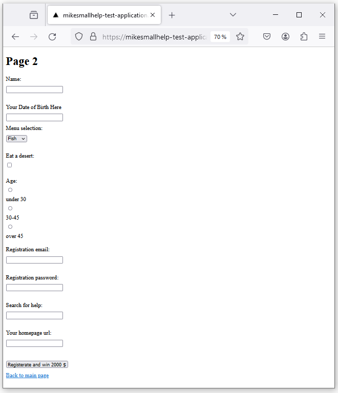
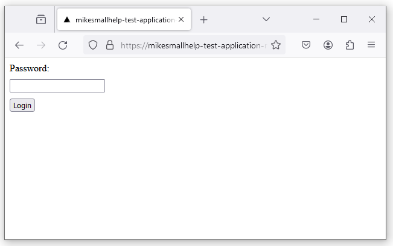

# wacat - Tests your web application against cat chaos!

Imagine, you leave your computer for a while and go to pick up a cup of coffee. Meanwhile, your cat walks over your keyboard and causes some chaos. 

wacat (walking cat) application for example:

- goes to your web application root url
- visits every link in your application in random order
- adds random inputs to form inputs
- selects random values from dropdown menus, checkboxes etc. 
- clicks on every button in random order

Additionally, wacat

- detects HTTP errors (for example HTTP 500 errors) between browser and server
- detects errors in the browser console log
- detects error strings from the web pages
  - you give the error strings in a parameter file
- supports random form text inputs configuration by a user 
- can read form inputs from external files (for example from resources like https://github.com/0xspade/Combined-Wordlists?tab=readme-ov-file)
- can test only links, this could for example be used in the smoke testing of your application
- supports some authentication scenarios
  - you give authentication configuration in a JSON file
- supports configuring pages, which are not visited
- supports a headless mode
- supports configuring a page download wait time and a whole test timeout value
- supports running in the CI pipeline

wacat uses the [Playwright](https://playwright.dev/) tool internally. wacat is tested to work with Windows, Linux and Mac.

Please create a new issue, if you find a bug or some particular feature is needed.

## Warnings

Please test only your own web application or have a permit for testing someone else's application. Testing someone else's application's vulnerabilites without permit could be illegal. 

Application is designed not to go outside of the host you are testing. But as this is my hobby project everything is possible and it's good to follow what the wacat application is doing and use ctrl + c if it goes to wrong page. Please also note that if your application uses authentication and your wacat authentication configuration is not correct or wacat is not working for your case, then your account could be locked or something like that. Also wacat could mess your applications's database etc. So it's good to test only in the test environment.

## Installation

### Install Node.js

[Install Node.js from here](https://nodejs.org/en)

### Clone wacat and install it

Clone the wacat repository, go to the wacat folder and run:

```
npm install && npx playwright install --with-deps && npm run build && npm i -g
```

Note: probably your password is asked, when you run previous command, because the Playwright tool is installed globally.

### Updating wacat

To update wacat version run:

```
git pull && npm install && npx playwright install --with-deps && npm run build && npm i -g
```

## Running

### Basic running

Run the command in the wacat folder:

```
wacat test <your url>
```

For example a command:

```
wacat test https://mikesmallhelp-test-application.vercel.app/
```
tests a simple application in the url https://mikesmallhelp-test-application.vercel.app/. The application have pages:




First the wacat application opens the Chromium browser and goes to the root URL, which was given for the command: 


The root page doesn't contain any input fields, dropdown menus etc. wacat simple collects links of the two sub pages and goes to them. In each sub page wacat first pushes the button. The it fills the form input, selects from the dropdown menu etc. Finally it pushes the button again. Here is the command, which you can copy, paste and run. Same way you can run all other examples and please feel free to use my test applications.

```
wacat test https://mikesmallhelp-test-application.vercel.app/
```
```
Testing in url: https://mikesmallhelp-test-application.vercel.app/. Please wait...


Running 1 test using 1 worker
[chromium] › test.spec.ts:40:1 › test an application
In the page: https://mikesmallhelp-test-application.vercel.app/
In the page: https://mikesmallhelp-test-application.vercel.app/working-page
Push the button #1
Filling the #1 text input field a value: qHre+Ohx;'w_}l<f_cl=n-?U^vtXCm1FZC4||
The #1 drop-down list. Selecting the option #2
Selecting the #1 checkbox
The #1 radio button group. Selecting the radio button #1
Filling the #1 email input field a value: hfymxkihm.zixurprs@otjhbiech.com
Filling the #1 password input field a value: B!2#2B!2bbBB22!bB1
Filling the #1 search input field a value: zOwJMweOnlw
Filling the #1 url input field a value: https://mx21i.com
Push the button #1
In the page: https://mikesmallhelp-test-application.vercel.app/working-page2
Push the button #1
Filling the #1 text input field a value: qHre+Ohx;'w_}l<f_cl=n-?U^vtXCm1FZC4||
The #1 drop-down list. Selecting the option #2
Selecting the #1 checkbox
The #1 radio button group. Selecting the radio button #2
Filling the #1 email input field a value: qgjrtywmerx.kxmiwsdoxjlk@jhcghovbpr.com
Filling the #1 password input field a value: 1Aa11a#2abb!
Filling the #1 search input field a value: fwyKERAv
Filling the #1 url input field a value: https://0zzvf8.net
Push the button #1
  1 passed (54.0s)
```
Note that output contains "1 passed" so wacat didn't find any errors in the application. Please note also that a default wait time for every page is 5000 milliseconds. If you want to change this time use the flag --wait (see later). In the examples below we use a flag --wait 2000, because it is enough for the test applications.

### Detect HTTP errors

wacat can detect HTTP errors between browser and server. For example if the button in the example application below is pushed the HTTP 500 error occurs.


An example about this is:

```
wacat test --wait 2000 https://mikesmallhelp-test-application-http-500-error.vercel.app/
```
```
Testing in url: https://mikesmallhelp-test-application-http-500-error.vercel.app/. Please wait...

 ›   Error: 
 ›   Error occurred: Command failed: ROOT_URL='https://mikesmallhelp-test-application-http-500-error.vercel.app/' npx playwright test --project=chromium --headed
 ›    + stderr:  + stdout: 
 ›   Running 1 test using 1 worker
     [chromium] › test.spec.ts:40:1 › test an application
 ›   In the page: https://mikesmallhelp-test-application-http-500-error.vercel.app/
     In the page: https://mikesmallhelp-test-application-http-500-error.vercel.app/working-page
     Push the button #1
     Filling the #1 text input field a value: 4trK*edD
     The #1 drop-down list. Selecting the option #2
     Push the button #1
     In the page: https://mikesmallhelp-test-application-http-500-error.vercel.app/api-returns-http-500
     Push the button #1
     In the page: https://mikesmallhelp-test-application-http-500-error.vercel.app/api-returns-http-500: Request to https://mikesmallhelp-test-application-http-500-error.vercel.app/api/http-500 resulted
 ›    in status code 500
     In the page: https://mikesmallhelp-test-application-http-500-error.vercel.app/api-returns-http-500: Found an error message in the browser's console: Failed to load resource: the server responded 
 ›   with a status of 500 ()
     In the page: https://mikesmallhelp-test-application-http-500-error.vercel.app/api-returns-http-500: Found an error message in the browser's console: Error fetching data: Error: Network response was
 ›    not ok
 ›       at r (https://mikesmallhelp-test-application-http-500-error.vercel.app/_next/static/chunks/pages/api-returns-http-500-d6a108dd102494f7.js:1:1402)
 ›       at async n (https://mikesmallhelp-test-application-http-500-error.vercel.app/_next/static/chunks/pages/api-returns-http-500-d6a108dd102494f7.js:1:735)
       1) [chromium] › test.spec.ts:40:1 › test an application ──────────────────────────────────────────
 ›   
 ›       AssertionError: In the page: https://mikesmallhelp-test-application-http-500-error.vercel.app/api-returns-http-500: Request to 
 ›   https://mikesmallhelp-test-application-http-500-error.vercel.app/api/http-500 resulted in status code 500
 ›
 ›         51 |
 ›         52 |             if (!bypassHttpErrors) {
 ›       > 53 |                 fail(message);
 ›            |                 ^
 ›         54 |             }
 ›         55 |         }
 ›         56 |     });
 ›
 ›           at Page.<anonymous> (/home/lenovo/projektit/wacat/e2e-tests/test.spec.ts:53:17)
 ›
       1 failed
 ›       [chromium] › test.spec.ts:40:1 › test an application

```

So wacat detects HTTP 500 error, prints the error log with the text "1 failed" and stops the execution. The specific error message is:

```
AssertionError: In the page: https://mikesmallhelp-test-application-http-500-error.vercel.app/api-returns-http-500: Request to 
 ›   https://mikesmallhelp-test-application-http-500-error.vercel.app/api/http-500 resulted in status code 500
```

If you want to bypass stopping the execution in the HTTP errors use the flag --bypass-http-errors. For example the command

```
wacat test --wait 2000 --bypass-http-errors https://mikesmallhelp-test-application-http-500-error.vercel.app/
```

not stop into the HTTP 500 error like in the previous example. wacat prints to the log the HTTP 500 error, but the execution continues.

### Detect error strings from a target application's pages

Here is an example application, which contains in one sub page an error text "Error occurred!":


We configure in our example that "Error occurred!" is detected by wacat. We want also that the error text "abc" is detected. We configure this in a JSON file like this:

```
{
    "errorTextsInPages": ["abc", "Error occurred!"]
}
```
The run command (--conf flag is used to pass the JSON file) for Windows is:

```
wacat test --wait 2000 --conf example-files\configuration-error-texts.json https://mikesmallhelp-test-application-error-in-page.vercel.app
```
The run command for Linux and Mac is:

```
wacat test --wait 2000 --conf example-files/configuration-error-texts.json https://mikesmallhelp-test-application-error-in-page.vercel.app
```

The command output is:

```
Testing in url: https://mikesmallhelp-test-application-error-in-page.vercel.app. Please wait...

 ›   Error: Error occurred: Command failed: ROOT_URL='https://mikesmallhelp-test-application-error-in-page.vercel.app' CONFIGURATION_FILE_PATH=example-files/configuration-error-texts.json
 ›    npx playwright test --project=chromium
 ›    + stderr:  + stdout: 
 ›   Running 1 test using 1 worker
     [chromium] › test.spec.ts:29:1 › test an application
 ›   In the page: https://mikesmallhelp-test-application-error-in-page.vercel.app/
     Check the page not contain the abc text
     Check the page not contain the Error occurred! text
     In the page: https://mikesmallhelp-test-application-error-in-page.vercel.app/working-page
     Check the page not contain the abc text
     Check the page not contain the Error occurred! text
     Fill the #0 input field a value: 4eqhz14r
     #0 drop-down list. Select the option #1
     Push the button #0
     Check the page not contain the abc text
     Check the page not contain the Error occurred! text
     In the page: https://mikesmallhelp-test-application-error-in-page.vercel.app/error-text-in-page
     Check the page not contain the abc text
     Check the page not contain the Error occurred! text
       1) [chromium] › test.spec.ts:29:1 › test an application ──────────────────────────────────────────
 ›   
 ›       Error: expect(received).not.toContain(expected) // indexOf
 ›
 ›       Expected substring: not "Error occurred!"
 ›       Received string:        "Test page - error-text-in-pageError occurred!{\"props\":{\"pageProps\":{}},\"page\":\"/error-text-in-page\",\"query\":{},\"buildId\":\"qQ0wdj-2mwRrndTkG4FBO\",\"nextExp
 ›   ort\":true,\"autoExport\":true,\"isFallback\":false,\"scriptLoader\":[]}"
 ›
 ›          96 |     for (const errorText of configuration.errorTextsInPages) {
 ›          97 |         console.log(`Check the page not contain the ${errorText} text`);
 ›       >  98 |         expect(content).not.toContain(errorText);
 ›             |                             ^
 ›          99 |     }
 ›         100 | }
 ›         101 |
 ›
 ›           at checkPageForErrors (/home/lenovo/projektit/wacat/e2e-tests/test.spec.ts:98:29)
 ›           at handlePage (/home/lenovo/projektit/wacat/e2e-tests/test.spec.ts:84:5)
 ›           at visitLinks (/home/lenovo/projektit/wacat/e2e-tests/test.spec.ts:154:13)
 ›           at handlePage (/home/lenovo/projektit/wacat/e2e-tests/test.spec.ts:86:5)
 ›           at /home/lenovo/projektit/wacat/e2e-tests/test.spec.ts:47:5
 ›
       1 failed
 ›       [chromium] › test.spec.ts:29:1 › test an application
```

So wacat detects "Error occurred!" text in one sub page, reports error with the "1 failed" text and execution stops.

### Detect errors in the browser's console

Here is an example application, which contains an error logging in the browser's console


When an example command

```
wacat test --wait 2000 https://mikesmallhelp-test-application-error-in-browser-console.vercel.app
```

is run the execution stops into the error logging in the browser's console:

```
Testing in url: https://mikesmallhelp-test-application-error-in-browser-console.vercel.app. Please wait...

 ›   Error: 
 ›   Error occurred: Command failed: ROOT_URL='https://mikesmallhelp-test-application-error-in-browser-console.vercel.app' npx playwright test --project=chromium --headed
 ›    + stderr:  + stdout: 
 ›   Running 1 test using 1 worker
     [chromium] › test.spec.ts:34:1 › test an application
 ›   In the page: https://mikesmallhelp-test-application-error-in-browser-console.vercel.app/
     In the page: https://mikesmallhelp-test-application-error-in-browser-console.vercel.app/error-in-browser-console: Found an error message in the browser's console: Hello! Something wrong!
       1) [chromium] › test.spec.ts:34:1 › test an application ──────────────────────────────────────────
 ›   
 ›       AssertionError: In the page: https://mikesmallhelp-test-application-error-in-browser-console.vercel.app/error-in-browser-console: Found an error message in the browser's console: Hello! Something 
 ›   wrong!
 ›
 ›         58 |
 ›         59 |             if (!bypassBrowserConsoleErrors && !bypassHttpErrors) {
 ›       > 60 |                 fail(message);
 ›            |                 ^
 ›         61 |             }
 ›         62 |         }
 ›         63 |     });
 ›
 ›           at Page.<anonymous> (/home/lenovo/projektit/wacat/e2e-tests/test.spec.ts:60:17)
 ›
       1 failed
 ›       [chromium] › test.spec.ts:34:1 › test an application
```
wacat prints the message "Found an error message in the browser's console: Hello! Something wrong!" and stops the execution.

If you want to bypass this check and stop the execution use the flag --bypass-browser-console-errors. If the command

```
wacat test --wait 2000 --bypass-browser-console-errors https://mikesmallhelp-test-application-error-in-browser-console.vercel.app
```
is run the execution doesn't stop like in the previous example. wacat logs the error message, but continues the execution.

### Configure the random form inputs

Normally wacat creates random form inputs. By default the length is something between 1 and 60 characters and a default character set is used. Give the min length with the flag --random-input-texts-min-length and the max length with the flag --random-input-texts-max-length. Give the character set with the flag --random-input-texts-charset. The example command and output is:

```
wacat test --wait 2000 --random-input-texts-min-length 1 --random-input-texts-max-length 3 --random-input-texts-charset ®©¥¬¿ https://mikesmallhelp-test-application.vercel.app/
```

```
Testing in url: https://mikesmallhelp-test-application.vercel.app/. Please wait...


Running 1 test using 1 worker
[chromium] › test.spec.ts:38:1 › test an application
In the page: https://mikesmallhelp-test-application.vercel.app/
In the page: https://mikesmallhelp-test-application.vercel.app/working-page2
Fill the #0 input field a value: ¥
#0 drop-down list. Select the option #1
Push the button #0
In the page: https://mikesmallhelp-test-application.vercel.app/working-page
Fill the #0 input field a value: ¥©¬
#0 drop-down list. Select the option #1
Push the button #0
  1 passed (19.0s)
```

In this example wacat generates random string ```¥©¬```.

### Read input field texts from the file

Normally wacat fills the form input fields with the random strings. It is possible to read input fields from the file, for example from the file example-files/input.texts, which contents are:

```
xaxa
ybyb
```
wacat uses each input text from the file for the each input field in the target application. The run command is for the local file in Windows:

```
wacat test --wait 2000 --input-texts example-files\input-texts.txt https://mikesmallhelp-test-application.vercel.app/ 
```

and in Linux and Mac:

```
wacat test --wait 2000 --input-texts example-files/input-texts.txt https://mikesmallhelp-test-application.vercel.app/ 
```

and for the remote file:

```
wacat test --wait 2000 --input-texts https://raw.githubusercontent.com/mikesmallhelp/wacat/main/example-files/input-texts.txt https://mikesmallhelp-test-application.vercel.app/
```

All commands should output following:

```
Testing in url: https://mikesmallhelp-test-application.vercel.app/. Please wait...

Running 1 test using 1 worker
[chromium] › test.spec.ts:29:1 › test an application
In the page: https://mikesmallhelp-test-application.vercel.app/
In the page: https://mikesmallhelp-test-application.vercel.app/working-page
Fill the #0 input field a value: xaxa
#0 drop-down list. Select the option #1
Push the button #0
Fill the #0 input field a value: ybyb
#0 drop-down list. Select the option #1
Push the button #0
In the page: https://mikesmallhelp-test-application.vercel.app/working-page2
Fill the #0 input field a value: xaxa
#0 drop-down list. Select the option #1
Push the button #0
Fill the #0 input field a value: ybyb
#0 drop-down list. Select the option #1
Push the button #0
  1 passed (22.9s)
```

In the output you can see that values from the input-texts.txt file are used. You can use for the testing different input text files, for example from the page https://github.com/0xspade/Combined-Wordlists?tab=readme-ov-file. When you use a big input text file, use --timeout parameter (see below) with enough big value. Tested with 5000 lines input text file against a simple test application.

## Test only links

To test only links in the application use a ```--only-links``` flag. Then wacat loads pages and detects HTTP errors, but input fields are not filled etc. An example command and output are:

```
wacat test --wait 2000 --only-links https://mikesmallhelp-test-application.vercel.app/
```
```
Testing in url: https://mikesmallhelp-test-application.vercel.app/. Please wait...


Running 1 test using 1 worker
[chromium] › test.spec.ts:30:1 › test an application
In the page: https://mikesmallhelp-test-application.vercel.app/
In the page: https://mikesmallhelp-test-application.vercel.app/working-page
In the page: https://mikesmallhelp-test-application.vercel.app/working-page2
  1 passed (14.9s)
```

## Do authencation

Here is an application with a simple authentication


wacat can do authentication to this application with the following JSON file:

```

{
    "authentication": {
        "usernameLabel": "Username",
        "usernameValue": "Mike",
        "passwordLabel": "Password",
        "passwordValue": "Smallhelp",
        "loginButtonLabel": "Login"
    }
}

```

Note for example that the application contains "Username" label and this is put into the "usernameLabel" attribute's value in the JSON. The username value is "Mike", which is put into the "usernameValue" attribute's value in the JSON. And same logic applies for the password input field. The application has a button named "Login", which is put into the "loginButtonLabel" attribute's value in the JSON.

The example run command for Windows is:

```
wacat test --wait 2000 --conf example-files\configuration-authentication.json https://mikesmallhelp-test-application-simple-authentication.vercel.app/
```

The run command for Linux and Mac is:

```
wacat test --wait 2000 --conf example-files/configuration-authentication.json https://mikesmallhelp-test-application-simple-authentication.vercel.app/
```

The command output is:

```
Testing in url: https://mikesmallhelp-test-application-simple-authentication.vercel.app/. Please wait...

Running 1 test using 1 worker
[chromium] › test.spec.ts:29:1 › test an application
Filled the username and the password. Pushed the authentication button
In the page: https://mikesmallhelp-test-application-simple-authentication.vercel.app/
In the page: https://mikesmallhelp-test-application-simple-authentication.vercel.app/working-page
Fill the #0 input field a value: 5yzn4z93
#0 drop-down list. Select the option #1
Push the button #0
In the page: https://mikesmallhelp-test-application-simple-authentication.vercel.app/working-page2
Fill the #0 input field a value: 5zl4fvk4
#0 drop-down list. Select the option #1
Push the button #0
  1 passed (19.4s)

```

Note in the output the text "Filled the username and the password. Pushed the authentication button", this means that wacat did the authentication.

### Do more complicated authentication

Here is an application with a more complicated authentication





wacat can do authentication to this application with the following JSON file:

```

{
    "authentication": {
        "beforeAuthenticationLinkTexts": [
            "Please go to an application",
            "Please login"
        ],
        "usernameLabel": "Username",
        "usernameValue": "Mike",
        "usernameButtonLabel": "Next",
        "passwordLabel": "Password",
        "passwordValue": "Smallhelp",
        "loginButtonLabel": "Login"
    }
}

```

The JSON is more complicated than in previous example. Is has "beforeAuthenticationLinkTexts" attribute, which contains the link texts "Please go to an application" and "Please login", which are in the pages before the authentication page. The application has button "Next" in the page where username is given. The "Next" value is given into the "usernameButtonLabel" JSON attribute's value.

The example run command for Windows is:

```
wacat test --wait 2000 --conf example-files\configuration-complicated-authentication.json https://mikesmallhelp-test-application-more-complicated-authentication.vercel.app/
```
The run command for Linux and Mac is:

```
wacat test --wait 2000 --conf example-files/configuration-complicated-authentication.json https://mikesmallhelp-test-application-more-complicated-authentication.vercel.app/
```

The command output is:

```
Testing in url: https://mikesmallhelp-test-application-more-complicated-authentication.vercel.app/. Please wait...

Running 1 test using 1 worker
[chromium] › test.spec.ts:29:1 › test an application
Filled the username and the password. Pushed the authentication button
In the page: https://mikesmallhelp-test-application-more-complicated-authentication.vercel.app/
In the page: https://mikesmallhelp-test-application-more-complicated-authentication.vercel.app/logout
In the page: https://mikesmallhelp-test-application-more-complicated-authentication.vercel.app/working-page
Fill the #0 input field a value: if324rll
#0 drop-down list. Select the option #1
Push the button #0
In the page: https://mikesmallhelp-test-application-more-complicated-authentication.vercel.app/working-page2
Fill the #0 input field a value: k1fqcdhg
#0 drop-down list. Select the option #1
Push the button #0
  1 passed (24.5s)
```

### Configure pages, which are not visited

wacat is designed so that it should not go outside of the host you are testing. You can also configure more page urls, which are not visited.

Look in the previous example

```
In the page: https://mikesmallhelp-test-application-more-complicated-authentication.vercel.app/logout
```

If you don't want to go into the logout page, add the "notVisitLinkUrls" attribute into the JSON. It contains the urls, which are not visited. An example JSON is:

```
{
    "authentication": {
        "beforeAuthenticationLinkTexts": [
            "Please go to an application",
            "Please login"
        ],
        "usernameLabel": "Username",
        "usernameValue": "Mike",
        "usernameButtonLabel": "Next",
        "passwordLabel": "Password",
        "passwordValue": "Smallhelp",
        "loginButtonLabel": "Login"
    },
    "notVisitLinkUrls": [
        "https://mikesmallhelp-test-application-more-complicated-authentication.vercel.app/logout"
    ]
}
```

The example run command for Windows is:

```
wacat test --wait 2000 --conf example-files/configuration-complicated-authentication-with-not-visit-link-urls-remote.json https://mikesmallhelp-test-application-more-complicated-authentication.vercel.app/
```

The run command for Linux and Mac is:

```
wacat test --wait 2000 --conf example-files/configuration-complicated-authentication-with-not-visit-link-urls-remote.json https://mikesmallhelp-test-application-more-complicated-authentication.vercel.app/
```

The command output is:

```
Testing in url: https://mikesmallhelp-test-application-more-complicated-authentication.vercel.app/. Please wait...

Running 1 test using 1 worker
[chromium] › test.spec.ts:29:1 › test an application
Filled the username and the password. Pushed the authentication button
In the page: https://mikesmallhelp-test-application-more-complicated-authentication.vercel.app/
In the page: https://mikesmallhelp-test-application-more-complicated-authentication.vercel.app/working-page
Fill the #0 input field a value: k825ikgw
#0 drop-down list. Select the option #1
Push the button #0
In the page: https://mikesmallhelp-test-application-more-complicated-authentication.vercel.app/working-page2
Fill the #0 input field a value: 5okrd0c6
#0 drop-down list. Select the option #1
Push the button #0
  1 passed (21.4s)
```

Note now there are not the line:

```
In the page: https://mikesmallhelp-test-application-more-complicated-authentication.vercel.app/logout
```

in the output.

### Run in headless mode

Use the flag --headless to run with the headless mode (without browser). The example command is:

```
wacat test --wait 2000 --headless https://mikesmallhelp-test-application.vercel.app/
```

### Run in CI pipeline

wacat can be used in the CI pipeline with the --headless flag. The example is https://github.com/mikesmallhelp/mikesmallhelp-test-passing-run/blob/main/.github/workflows/testing.yaml.

### Configure wait time

By default wacat waits each page download 2000 milliseconds. Configure the page download wait time in milliseconds with --wait flag. The example command with 1000 milliseconds wait is:

```
wacat test --wait 1000 https://mikesmallhelp-test-application.vercel.app/
```
Note: wacat uses internally the Playwright tool. Normally the Playwright test can wait for some specific text. But wacat doesn't know what text to wait, so wait time is used.

### Configure whole test timeout

By default whole test command timeout is 120 seconds. Configure the whole test timeout in seconds with --timeout flag. The timeout value is at least 1 seconds. The example command with 50 seconds timeout is:

```
wacat test --timeout 50 https://mikesmallhelp-test-application.vercel.app/
```
Note: Playwright uses internally milliseconds. So if the timeout in this example happens the output is something like:

```
Test timeout of 50000ms exceeded.
```

### Help command

To see all the flags, run the command:

```
wacat test --help
Test any web application, for example: wacat test http://localhost:3000

USAGE
  $ wacat test URL [--conf <value>] [--debug] [--error-texts <value>] [--headless] [--input-texts <value>] [--only-links] [--timeout <value>] [--wait <value>]

ARGUMENTS
  URL  Application url to test, for example: http://localhost:3000

FLAGS
  --conf=<value>         Path to the configuration file
  --debug                Enable debug mode
  --error-texts=<value>  Path to the error texts file
  --headless             Headless mode
  --input-texts=<value>  Path to the input texts file
  --only-links           Test only links
  --timeout=<value>      A whole test run timeout in seconds
  --wait=<value>         A wait in milliseconds to wait a page load etc.

DESCRIPTION
  Test any web application, for example: wacat test http://localhost:3000

EXAMPLES
  $ wacat test http://localhost:3000
```

## Developing wacat

### Technologies

wacat technology stack is simple:

- Typescript
- Bash script
- oclif, The Open CLI Framework
- Playwright
- Next.js for the test applications

### Developing

In Linux and Mac, do your changes and run

```
npm run test && npm run build && npm install -g && ./run-tests.sh
```
The run-tests.sh script runs all test cases and verifies that wacat works correctly.

In Windows do your changes and run

```
npm run test && npm run build && npm install -g
```
For Windows there isn't yet the automatic test script like ./run-tests.sh. Run

```
run-manual-tests.bat
```

and verify from the output that everything works correctly.

## Contributions

Contributions are warmly welcome. Look for the issues page. Please create a new issue, if you find a bug or some particular feature is needed.

Please note: If you add a new feature, add a test case for that. Please look `run-tests.sh` file. Please consider also adding unit tests.


