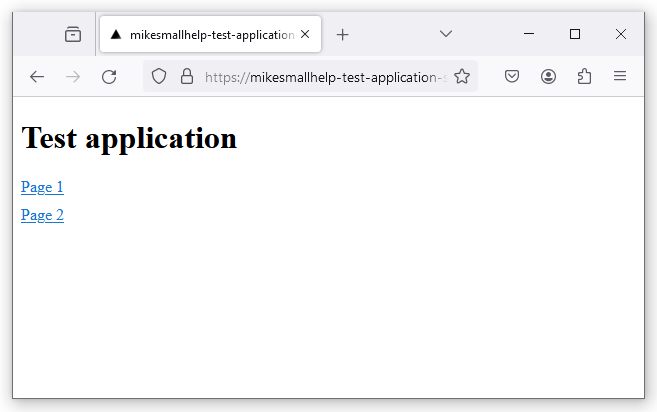
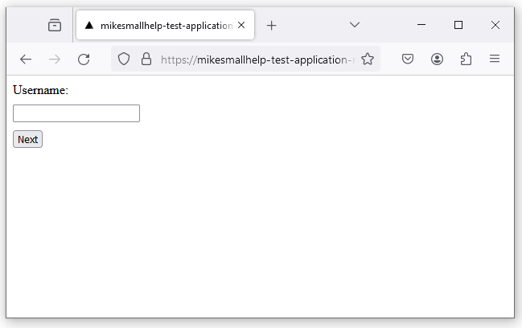

# wacat - Challenge Your Web App with Cat Chaos and AI-Driven Testing!

Imagine, you leave your computer for a while and go to pick up a cup of coffee. Meanwhile, your cat walks over your keyboard and causes some chaos. 

wacat (walking cat) application

- Navigates to the root URL of your web application
- Visits every link in your application in a random order
- Inputs random text into forms
- Selects random values from dropdown menus, checkboxes, etc
- Clicks every button in a random order

Additionally, wacat:

- Detects error messages on web pages using AI
  - This is an optional feature and requires an OpenAI API key
- Generates AI-driven content for input fields
  - Optional feature requiring an OpenAI API key
  - Supports generating invalid or broken input content
- Detects HTTP errors (e.g., HTTP 500 errors) between the browser and server
- Detects errors in the browser's console log
- Detects user-defined error messages on web pages
  - These error messages are specified in a parameter file
  - Use this if AI is not enabled
- Supports user-defined configurations for random form text inputs
- Can read form inputs from external files (e.g., resources like [Combined-Wordlists](<https://github.com/0xspade/Combined-Wordlists?tab=readme-ov-file)>))
- Can focus exclusively on testing links, which is useful for smoke testing your application
- Supports some authentication scenarios
  - Authentication configurations are provided in a JSON file
- Allows configuration of pages that should not be visited
- Allows configuration of buttons that should not be pushed
- Supports adding headers to tests
  - Can be used for example for the authentication in the manual tests
- Supports a headless mode
- Allows configuration of page download wait times and overall test timeout values
- Supports running in CI pipelines

## Technical details

wacat uses the Playwright tool internally. It is tested to work on Windows, Linux, and Mac.

## Reporting bugs and requesting features

If you encounter a bug or need a specific feature, please create a new issue.

## Current Version

The current version of wacat is 1.5.0. Please refer to the end of this page for the change history.

## Warnings
Please ensure you only test your own web application or have explicit permission to test someone else’s application. Testing the vulnerabilities of an application without authorization could be illegal.

The application is designed to stay within the host you are testing. However, as this is a hobby project, unexpected behavior is possible. It's important to monitor wacat's actions and use Ctrl + C to stop the process if it navigates to an unintended page.

Additionally, if your application requires authentication and your wacat authentication configuration is incorrect or incompatible, it could lead to issues such as account lockouts. wacat could also potentially disrupt your application's database or other components. For these reasons, it is strongly recommended to use wacat only in a testing environment.

## Installation

### Install Node.js

[Install Node.js from here](https://nodejs.org/en). wacat has been tested and verified to work with Node.js version 20 on Linux, Mac, and Windows.

### Clone wacat and install it

Clone the wacat repository, navigate to the wacat folder, and run the following command:

```
npm install && npx playwright install --with-deps && npm run build && npm install -g
```

Note: You may be prompted for your password when running the above command, as the Playwright tool is installed globally.

### Optional: Add OpenAI API Key

If you want to use AI for error detection (see details below), add your OpenAI API key and model to a .env file:

```
OPENAI_API_KEY=<your key here>
OPENAI_API_MODEL=<your model here>
```

Important: Providing an OpenAI API key will result in charges from OpenAI for API usage. While wacat has been thoroughly tested, please be aware that programming errors could lead to a higher-than-expected number of calls to the OpenAI API.

Additionally, please note that if your website contains sensitive material, the contents of your pages will be sent to the OpenAI API, and you must ensure that this aligns with your intended use. For example, it is possible that the content you send may be used as training data.

You can also add the following optional environment variable to the .env file:

```
MAX_PAGE_CONTENT_CHARS=<your value here>
```

This value sets the maximum number of characters sent to the OpenAI API for error detection. The default is 3000 if not specified. See additional details below.

You can optionally use the following environment variable:

```
AI_GENERATED_INPUT_TEXTS=true
```

When set to true, the OpenAI API will generate values for all input fields on each page. By default, this value is set to false. Please note that enabling this option can result in significant API usage. Therefore, it is recommended to have at least a Tier 1 usage plan, as it allows for a higher number of requests per minute compared to the Free tier.

### Updating wacat

To update wacat to the latest version, run:

```
git pull && npm install && npx playwright install --with-deps && npm run build && npm i -g
```

## Running

### Basic usage

Run the following command in the wacat folder:

```
wacat test <your url>
```

For example, the command:

```
wacat test https://mikesmallhelp-test-application.vercel.app/
```
tests a simple application at the URL https://mikesmallhelp-test-application.vercel.app/. The application includes the following pages:


First, the wacat application opens the Chromium browser and navigates to the root URL provided in the command: 


The root page does not contain any input fields, dropdown menus, or similar elements. wacat simply collects links to the two subpages and visits them. On each subpage, wacat performs the following actions:

1. Presses the button
2. Fills the form fields, selects options from dropdown menus, etc.
3. Presses the button again

Here is the command for you to copy, paste, and run. You can follow the same process to run all other examples. Feel free to experiment with the provided test applications.

```
wacat test https://mikesmallhelp-test-application.vercel.app/
```
```
Testing in url: https://mikesmallhelp-test-application.vercel.app/. Please wait...


Running 1 test using 1 worker
[chromium] › test.spec.ts:41:1 › test an application
In the page: https://mikesmallhelp-test-application.vercel.app/
In the page: https://mikesmallhelp-test-application.vercel.app/working-page2
Push the button #1
Filling the #1 text input field a value: _k6AKNU3z"{=myqS.K
The label is 'Your Date of Birth Here', so generating an appropriate random content for the input field
Filling the #2 text input field a value: 16/09/2004
The #1 drop-down list. Selecting the option #2
Selecting the #1 checkbox
The #1 radio button group. Selecting the radio button #3
Filling the #1 email input field a value: pvcgigtju.nwntltbk@uqimkbwwiz.com
Filling the #1 password input field a value: A#1!!a#!#AaA!A
Filling the #1 search input field a value: SZOmqATkrV
Filling the #1 url input field a value: https://nrebn.com
Push the button #1
In the page: https://mikesmallhelp-test-application.vercel.app/working-page
Push the button #1
Filling the #1 text input field a value: _k6AKNU3z"{=myqS.K
The label is 'Your Date of Birth Here', so generating an appropriate random content for the input field
Filling the #2 text input field a value: 16/09/2004
The #1 drop-down list. Selecting the option #2
Selecting the #1 checkbox
The #1 radio button group. Selecting the radio button #2
Filling the #1 email input field a value: uxxdxqcjhq.mhettm@ukyefgvdsk.gov
Filling the #1 password input field a value: aa2B#1aA!##2A#!AaA
Filling the #1 search input field a value: lSjsBVOzkhCC
Filling the #1 url input field a value: https://vpo7ut.net
Push the button #1
  1 passed (24.3s)
```
Note: The default wait time for each page is 5000 milliseconds. To adjust this wait time, use the --wait flag (see details later).

### Optional: Detect errors on the page with AI

Here is an example application that contains an error message, "An unexpected error occurred! Please try again after some time.", on one of its subpages:


If you provide an OpenAI API key (see above), wacat can use AI to detect error messages like this on the page.

For example, run the command:

```
wacat test https://mikesmallhelp-test-application-error-in-page.vercel.app/
```

The command output might look like this:

```
Testing in url: https://mikesmallhelp-test-application-error-in-page.vercel.app/. Please wait...

 ›   Error: 
 ›   Error occurred: Command failed: ROOT_URL='https://mikesmallhelp-test-application-error-in-page.vercel.app/' npx playwright test --project=chromium --headed
 ›    + stderr:  + stdout: 
 ›   Running 1 test using 1 worker
     [chromium] › test.spec.ts:45:1 › test an application
 ›   In the page: https://mikesmallhelp-test-application-error-in-page.vercel.app/
     Check with the AI that the page doesn't contain errors.
     In the page: https://mikesmallhelp-test-application-error-in-page.vercel.app/working-page
     Check with the AI that the page doesn't contain errors.
     Push the button #1
     Check with the AI that the page doesn't contain errors.
     Filling the #1 text input field a value: AyXoEJ_Sd$(7+JqeROkD
     The #1 drop-down list. Selecting the option #2
     Push the button #1
     Check with the AI that the page doesn't contain errors.
     In the page: https://mikesmallhelp-test-application-error-in-page.vercel.app/error-text-in-page
     Check with the AI that the page doesn't contain errors.
       1) [chromium] › test.spec.ts:45:1 › test an application ──────────────────────────────────────────
 ›   
 ›       AssertionError: The AI detected that current page contains error, the page contents are: Test page An unexpected error occurred! Please try again after some time.
 ›
 ›         162 |                 console.log(errorMessage);
 ›         163 |             } else {
 ›       > 164 |                 fail(errorMessage);
 ›             |                 ^
 ›         165 |             }
 ›         166 |         }
 ›         167 |     }
 ›
 ›           at checkPageForErrors (/home/lenovo/projektit/wacat/e2e-tests/test.spec.ts:164:17)
 ›           at handlePage (/home/lenovo/projektit/wacat/e2e-tests/test.spec.ts:127:5)
 ›           at visitLinks (/home/lenovo/projektit/wacat/e2e-tests/test.spec.ts:507:13)
 ›           at handlePage (/home/lenovo/projektit/wacat/e2e-tests/test.spec.ts:137:5)
 ›           at /home/lenovo/projektit/wacat/e2e-tests/test.spec.ts:78:5
 ›
       1 failed
 ›       [chromium] › test.spec.ts:45:1 › test an application ───────────────────────────────────────────

```

When wacat uses AI, it logs the message:

```
Check with the AI that the page doesn't contain errors.
``` 

for every page.

If the AI detects an error, wacat logs a message like this (see the error message above):

```
The AI detected that current page contains error, the page contents are: Test page An unexpected error occurred! Please try again after some time.
```

To log AI errors without halting the test, use the --bypass-ai-errors flag. For example:

```
wacat test --bypass-ai-errors https://mikesmallhelp-test-application-error-in-page.vercel.app/
```

#### Handling OpenAI API rate limits

The OpenAI API has rate limits based on your organization's subscription. For example, if you see an error like this:

```
Error: 429 Rate limit reached for *** in organization 
 ›   ************ on requests per min (RPM): Limit 3, Used 3, 
 ›   Requested 1. Please try again in 20s.
```

use the --wait parameter (as explained below) to slow down wacat's requests. You may also need to adjust the test timeout using the --timeout parameter (as explained below).

For daily request limits, such as:

```
Error: 429 Rate limit reached for *** in organization 
 ›   ************ on requests per day (RPD): Limit 200, Used 
 ›   200, Requested 1. Please try again in 7m12s.
```

wait for the limit to reset, and then rerun wacat.

#### Managing OpenAI token usage

If your queries exceed the API's tokens-per-minute limit, you can use the MAX_PAGE_CONTENT_CHARS .env variable (see above) to control the number of characters wacat sends per page to the API for analysis.

The base prompt contains approximately 1600 characters. For example, if you set MAX_PAGE_CONTENT_CHARS to 400, the total prompt size will be around 2000 characters, or roughly 500 tokens (1 token is approximately 4 characters in English). The response will always consist of a single token, so primarily manage the prompt size.

For more details, refer to https://help.openai.com/en/articles/4936856-what-are-tokens-and-how-to-count-them.

### Optional: AI-generated input field content

The AI can generate content for HTML input fields based on the ```type```, ```autocomplete```, or ```placeholder``` attributes of the input element. It can also use the field's label content to assist in generating the input. This feature can be enabled by setting the ```AI_GENERATED_INPUT_TEXTS``` environment variable (refer to the details above).

Here’s an example of an application page:


If you run the following command:

```
wacat test https://mikesmallhelp-test-application-simple.vercel.app/
```

The output might look like this:

```
Testing in url: https://mikesmallhelp-test-application-simple.vercel.app/. Please wait...


Running 1 test using 1 worker
[chromium] › test.spec.ts:50:1 › test an application
In the page: https://mikesmallhelp-test-application-simple.vercel.app/
Check with the AI that the page doesn't contain errors.
In the page: https://mikesmallhelp-test-application-simple.vercel.app/test-page
Check with the AI that the page doesn't contain errors.
Push the button #1
Check with the AI that the page doesn't contain errors.
Filling the #1 input field with the AI, type: text, autocomplete: no autocomplete, placeholder: no placeholder, label: Email, the generated value: julia.smith@hotmail.com
Filling the #2 input field with the AI, type: text, autocomplete: cc-number, placeholder: no placeholder, label: no label, the generated value: 4532 9876 5432 1234
Filling the #3 input field with the AI, type: no type, autocomplete: no autocomplete, placeholder: 01/01/1990, label: no label, the generated value: 15/07/1985
Push the button #1
Check with the AI that the page doesn't contain errors.
  1 passed (1.7m)
```

In the lines:

```
Filling the #1 input field with the AI, type: text, autocomplete: no autocomplete, placeholder: no placeholder, label: Email, the generated value: julia.smith@hotmail.com
Filling the #2 input field with the AI, type: text, autocomplete: cc-number, placeholder: no placeholder, label: no label, the generated value: 4532 9876 5432 1234
Filling the #3 input field with the AI, type: no type, autocomplete: no autocomplete, placeholder: 01/01/1990, label: no label, the generated value: 15/07/1985
```

you can see that the AI automatically generated the content for the input fields based on their type and label.

### Optional: AI-generated invalid or broken input values

wacat can generate input values that are broken in various ways and to varying degrees for testing purposes. The level of brokenness can range from 
inputs with only minor errors to deliberately highly broken inputs that may contain multiple inconsistencies or severe issues. 
If the ```AI_GENERATED_INPUT_TEXTS``` environment variable is set to true (refer to the details above), AI is used to generate input texts.

Example of a simple application page:


The following commands are identical in syntax, regardless of whether AI is used. For example, if AI is enabled and the following command is executed:

```
wacat test --broken-input-values https://mikesmallhelp-test-application-simple.vercel.app/
```

The output might look like this:

```
Testing in url: https://mikesmallhelp-test-application-simple.vercel.app/. Please wait...


Running 1 test using 1 worker
[chromium] › test.spec.ts:50:1 › test an application
In the page: https://mikesmallhelp-test-application-simple.vercel.app/
Check with the AI that the page doesn't contain errors.
In the page: https://mikesmallhelp-test-application-simple.vercel.app/test-page
Check with the AI that the page doesn't contain errors.
Push the button #1
Check with the AI that the page doesn't contain errors.
Filling the #1 input field with the AI, type: text, autocomplete: no autocomplete, placeholder: no placeholder, label: Email, the generated value: test@example,com (the broken input value used)
Filling the #2 input field with the AI, type: text, autocomplete: cc-number, placeholder: no placeholder, label: no label, the generated value: 5221-4823-76$$--02345-8823####slkfjddl (the broken input value used)
Filling the #3 input field with the AI, type: no type, autocomplete: no autocomplete, placeholder: 01/01/1990, label: no label, the generated value: 01/.01.199ama9🔥💥🥴¾⅓⅔🗺️👂🎉😤🚀🛸🌌 (the broken input value used)
Push the button #1
Check with the AI that the page doesn't contain errors.
  1 passed (1.8m)

```

In this example, the broken input values are clearly indicated in the output with the text ```(the broken input value used)```. Examples include:

- A broken email address: ```test@example,com```
- A broken credit card's number: ```5221-4823-76$$--02345-8823####slkfjddl```
- A broken date: ```01/.01.199ama9🔥💥🥴¾⅓⅔🗺️👂🎉😤🚀🛸🌌```

#### Using the ```--broken-input-values-percentage``` flag

If you want only a portion of the input values to be broken, you can use the ```--broken-input-values-percentage``` flag. This flag allows you to specify a percentage (0-100) of inputs to be intentionally broken or invalid. For instance, setting this flag to 34 means approximately 34% of inputs will be invalid.

For example:

```
wacat test --broken-input-values --broken-input-values-percentage 34 https://mikesmallhelp-test-application-simple.vercel.app/
```

This command might produce the following output:

```
Testing in url: https://mikesmallhelp-test-application-simple.vercel.app/. Please wait...


Running 1 test using 1 worker
[chromium] › test.spec.ts:50:1 › test an application
In the page: https://mikesmallhelp-test-application-simple.vercel.app/
Check with the AI that the page doesn't contain errors.
In the page: https://mikesmallhelp-test-application-simple.vercel.app/test-page
Check with the AI that the page doesn't contain errors.
Push the button #1
Check with the AI that the page doesn't contain errors.
Filling the #1 input field with the AI, type: text, autocomplete: no autocomplete, placeholder: no placeholder, label: Email, the generated value: test@example,com@@@jjd (the broken input value used)
Filling the #2 input field with the AI, type: text, autocomplete: cc-number, placeholder: no placeholder, label: no label, the generated value: 4539 4512 0390 4573
Filling the #3 input field with the AI, type: no type, autocomplete: no autocomplete, placeholder: 01/01/1990, label: no label, the generated value: 15/08/1985
Push the button #1
Check with the AI that the page doesn't contain errors.
  1 passed (1.7m)

```

In this case, only the value ```test@example,com@@@jjd``` is broken, while the other inputs ```4539 4512 0390 4573``` and ```15/08/1985``` remains valid. This demonstrates how the ```--broken-input-values-percentage``` flag controls the proportion of invalid inputs.

By fine-tuning this parameter, you can simulate real-world scenarios where some user inputs may be erroneous or malformed.

### Detect HTTP errors

wacat can detect HTTP errors occurring between the browser and the server. For example, in the application shown below, clicking the button triggers an HTTP 500 error:


You can test this scenario with the following command:

```
wacat test https://mikesmallhelp-test-application-http-500-error.vercel.app/
```
The command output might look like this:
```
Testing in url: https://mikesmallhelp-test-application-http-500-error.vercel.app/. Please wait...

 ›   Error: 
 ›   Error occurred: Command failed: ROOT_URL='https://mikesmallhelp-test-application-http-500-error.vercel.app/' npx playwright test --project=chromium --headed
 ›    + stderr:  + stdout: 
 ›   Running 1 test using 1 worker
     [chromium] › test.spec.ts:40:1 › test an application
 ›   In the page: https://mikesmallhelp-test-application-http-500-error.vercel.app/
     In the page: https://mikesmallhelp-test-application-http-500-error.vercel.app/working-page
     Push the button #1
     Filling the #1 text input field a value: 4trK*edD
     The #1 drop-down list. Selecting the option #2
     Push the button #1
     In the page: https://mikesmallhelp-test-application-http-500-error.vercel.app/api-returns-http-500
     Push the button #1
     In the page: https://mikesmallhelp-test-application-http-500-error.vercel.app/api-returns-http-500: Request to https://mikesmallhelp-test-application-http-500-error.vercel.app/api/http-500 resulted
 ›    in status code 500
     In the page: https://mikesmallhelp-test-application-http-500-error.vercel.app/api-returns-http-500: Found an error message in the browser's console: Failed to load resource: the server responded 
 ›   with a status of 500 ()
     In the page: https://mikesmallhelp-test-application-http-500-error.vercel.app/api-returns-http-500: Found an error message in the browser's console: Error fetching data: Error: Network response was
 ›    not ok
 ›       at r (https://mikesmallhelp-test-application-http-500-error.vercel.app/_next/static/chunks/pages/api-returns-http-500-d6a108dd102494f7.js:1:1402)
 ›       at async n (https://mikesmallhelp-test-application-http-500-error.vercel.app/_next/static/chunks/pages/api-returns-http-500-d6a108dd102494f7.js:1:735)
       1) [chromium] › test.spec.ts:40:1 › test an application ──────────────────────────────────────────
 ›   
 ›       AssertionError: In the page: https://mikesmallhelp-test-application-http-500-error.vercel.app/api-returns-http-500: Request to 
 ›   https://mikesmallhelp-test-application-http-500-error.vercel.app/api/http-500 resulted in status code 500
 ›
 ›         51 |
 ›         52 |             if (!bypassHttpErrors) {
 ›       > 53 |                 fail(message);
 ›            |                 ^
 ›         54 |             }
 ›         55 |         }
 ›         56 |     });
 ›
 ›           at Page.<anonymous> (/home/lenovo/projektit/wacat/e2e-tests/test.spec.ts:53:17)
 ›
       1 failed
 ›       [chromium] › test.spec.ts:40:1 › test an application

```

In this example, wacat detects the HTTP 500 error, logs it with "1 failed," and stops execution. The specific error message is:

```
AssertionError: In the page: https://mikesmallhelp-test-application-http-500-error.vercel.app/api-returns-http-500: Request to 
 ›   https://mikesmallhelp-test-application-http-500-error.vercel.app/api/http-500 resulted in status code 500
```

#### Continuing execution despite HTTP errors

To prevent wacat from stopping execution on HTTP errors, use the --bypass-http-errors flag. For example:

```
wacat test --bypass-http-errors https://mikesmallhelp-test-application-http-500-error.vercel.app/
```

In this case, wacat logs the HTTP 500 error but continues the test execution without stopping.

### Detect user-defined error strings (if AI is not enabled)

Here is an example application where one subpage contains the error text: 

```
An unexpected error occurred! Please try again after some time.
```


In this example, we configure wacat to detect the error text "An unexpected error occurred! Please try again after some time." We also want wacat to detect the error text "abc". This configuration is added to a JSON file as follows:

```
{
    "errorTextsInPages": ["abc", "An unexpected error occurred! Please try again after some time."]
}
```
The run command to use this JSON configuration file (via the --conf flag) is as follows:

#### For Windows:

```
wacat test --conf example-files\configuration-error-texts.json https://mikesmallhelp-test-application-error-in-page.vercel.app
```

#### For Linux and Mac:

```
wacat test --conf example-files/configuration-error-texts.json https://mikesmallhelp-test-application-error-in-page.vercel.app
```

The command output is:

```
Testing in url: https://mikesmallhelp-test-application-error-in-page.vercel.app. Please wait...

 »   Error:
 »   Error occurred: Command failed: set ROOT_URL=https://mikesmallhelp-test-application-error-in-page.vercel.app && set CONFIGURATION_FILE_PATH=example-files\configuration-error-texts.json && npx playwright test --project=chromium
 »   --headed
 »    + stderr:  + stdout:
 »   Running 1 test using 1 worker
     [chromium] › test.spec.ts:45:1 › test an application
 »   In the page: https://mikesmallhelp-test-application-error-in-page.vercel.app/
     Check that the page doesn't contain the abc text
     Check that the page doesn't contain the An unexpected error occurred! Please try again after some time. text
     In the page: https://mikesmallhelp-test-application-error-in-page.vercel.app/error-text-in-page
     Check that the page doesn't contain the abc text
     Check that the page doesn't contain the An unexpected error occurred! Please try again after some time. text
       1) [chromium] › test.spec.ts:45:1 › test an application ──────────────────────────────────────────
 »
 »       Error: expect(received).not.toContain(expected) // indexOf
 »
 »       Expected substring: not "An unexpected error occurred! Please try again after some time."
 »       Received string:        "Test page An unexpected error occurred! Please try again after some time."
 »
 »         177 |     for (const errorText of configuration.errorTextsInPages) {
 »         178 |         console.log(`Check that the page doesn't contain the ${errorText} text`);
 »       > 179 |         expect(content).not.toContain(errorText);
 »             |                             ^
 »         180 |     }
 »         181 | }
 »         182 |
 »
 »           at checkPageForErrors (C:\repot\wacat\e2e-tests\test.spec.ts:179:29)
 »           at handlePage (C:\repot\wacat\e2e-tests\test.spec.ts:127:5)
 »           at visitLinks (C:\repot\wacat\e2e-tests\test.spec.ts:507:13)
 »           at handlePage (C:\repot\wacat\e2e-tests\test.spec.ts:137:5)
 »           at C:\repot\wacat\e2e-tests\test.spec.ts:78:5
 »
       1 failed
 »       [chromium] › test.spec.ts:45:1 › test an application ───────────────────────────────────────────
```

In this scenario, wacat detects the error text "An unexpected error occurred! Please try again after some time." on one subpage. It reports the error with the message "1 failed" and halts execution.

### Detect errors in the browser's console

Here is an example application that logs an error in the browser's console:


When the following command is run:

```
wacat test https://mikesmallhelp-test-application-error-in-browser-console.vercel.app
```

the execution stops when an error is detected in the browser's console:

```
Testing in url: https://mikesmallhelp-test-application-error-in-browser-console.vercel.app. Please wait...

 ›   Error: 
 ›   Error occurred: Command failed: ROOT_URL='https://mikesmallhelp-test-application-error-in-browser-console.vercel.app' WAIT=2000 npx playwright test --project=chromium --headed
 ›    + stderr:  + stdout: 
 ›   Running 1 test using 1 worker
     [chromium] › test.spec.ts:40:1 › test an application
 ›   In the page: https://mikesmallhelp-test-application-error-in-browser-console.vercel.app/
     In the page: https://mikesmallhelp-test-application-error-in-browser-console.vercel.app/working-page
     Push the button #1
     Filling the #1 text input field a value: q52<<r`k`bZzP<Jua#53RAn)cKg0&K14
     The #1 drop-down list. Selecting the option #2
     Push the button #1
     In the page: https://mikesmallhelp-test-application-error-in-browser-console.vercel.app/error-in-browser-console: Found an error message in the browser's console: Hello! Something wrong!
       1) [chromium] › test.spec.ts:40:1 › test an application ──────────────────────────────────────────
 ›   
 ›       AssertionError: In the page: https://mikesmallhelp-test-application-error-in-browser-console.vercel.app/error-in-browser-console: Found an error message in the browser's console: Hello! 
 ›   Something wrong!
 ›
 ›         62 |
 ›         63 |             if (!bypassBrowserConsoleErrors && !bypassHttpErrors) {
 ›       > 64 |                 fail(message);
 ›            |                 ^
 ›         65 |             }
 ›         66 |         }
 ›         67 |     });
 ›
 ›           at Page.<anonymous> (/home/lenovo/projektit/wacat/e2e-tests/test.spec.ts:64:17)
 ›
       1 failed
 ›       [chromium] › test.spec.ts:40:1 › test an application
```
In this example, wacat logs the message: 

```
Found an error message in the browser's console: Hello! Something wrong!
```

and stops execution.

#### Bypassing browser console error checks

If you want wacat to bypass this check and continue execution despite browser console errors, use the --bypass-browser-console-errors flag. For example:

```
wacat test --bypass-browser-console-errors https://mikesmallhelp-test-application-error-in-browser-console.vercel.app
```

In this case, wacat logs the error message but does not stop execution, continuing the test instead.

### Configure random form inputs

By default, wacat generates random form inputs with lengths ranging between 1 and 60 characters, using a default character set. You can customize these settings as follows:

- Use the flag --random-input-texts-min-length to set the minimum length of the random input
- Use the flag --random-input-texts-max-length to set the maximum length of the random input
- Use the flag --random-input-texts-charset to specify the character set for the random input

Here is an example command and its output:

```
wacat test --random-input-texts-min-length 1 --random-input-texts-max-length 3 --random-input-texts-charset ®©¥¬¿ https://mikesmallhelp-test-application.vercel.app/
```

```
Testing in url: https://mikesmallhelp-test-application.vercel.app/. Please wait...


Running 1 test using 1 worker
[chromium] › test.spec.ts:41:1 › test an application
In the page: https://mikesmallhelp-test-application.vercel.app/
In the page: https://mikesmallhelp-test-application.vercel.app/working-page
Push the button #1
Filling the #1 text input field a value: ®
Filling the #2 text input field a value: ®
Filling the #3 text input field a value: ®
Filling the #4 text input field a value: ®
Filling the #5 text input field a value: ®
Filling the #6 text input field a value: ®
The #1 drop-down list. Selecting the option #2
Selecting the #1 checkbox
The #1 radio button group. Selecting the radio button #3
Push the button #1
In the page: https://mikesmallhelp-test-application.vercel.app/working-page2
Push the button #1
Filling the #1 text input field a value: ®
Filling the #2 text input field a value: ®
Filling the #3 text input field a value: ®
Filling the #4 text input field a value: ®
Filling the #5 text input field a value: ®
Filling the #6 text input field a value: ®
The #1 drop-down list. Selecting the option #2
Selecting the #1 checkbox
The #1 radio button group. Selecting the radio button #2
Push the button #1
  1 passed (54.0s)
```

In this example, wacat generates random strings using the character set ```®©¥¬¿```. The generated strings have lengths between 1 and 3 characters. 

### Read input field texts from a file

It is also possible to configure wacat to read input field texts from a file. For example, consider the file example-files/input-texts.txt with the following contents:

```
xaxa
ybyb
```

wacat uses each line from the file as input for the fields in the target application, unless an error occurs or the page changes.

The command to run this with a local file on Windows is:

```
wacat test --input-texts example-files\input-texts.txt https://mikesmallhelp-test-application.vercel.app/ 
```

On Linux and Mac, the command is:

```
wacat test --input-texts example-files/input-texts.txt https://mikesmallhelp-test-application.vercel.app/ 
```

To use a remote file, the command is:

```
wacat test --input-texts https://raw.githubusercontent.com/mikesmallhelp/wacat/main/example-files/input-texts.txt https://mikesmallhelp-test-application.vercel.app/
```

All these commands produce the following output:

```
Testing in url: https://mikesmallhelp-test-application.vercel.app/. Please wait...

Running 1 test using 1 worker
[chromium] › test.spec.ts:41:1 › test an application
In the page: https://mikesmallhelp-test-application.vercel.app/
In the page: https://mikesmallhelp-test-application.vercel.app/working-page
Push the button #1
Filling the #1 text input field a value: xaxa
Filling the #2 text input field a value: xaxa
Filling the #3 text input field a value: xaxa
Filling the #4 text input field a value: xaxa
Filling the #5 text input field a value: xaxa
Filling the #6 text input field a value: xaxa
The #1 drop-down list. Selecting the option #2
Selecting the #1 checkbox
The #1 radio button group. Selecting the radio button #3
Push the button #1
Filling the #1 text input field a value: ybyb
Filling the #2 text input field a value: ybyb
Filling the #3 text input field a value: ybyb
Filling the #4 text input field a value: ybyb
Filling the #5 text input field a value: ybyb
Filling the #6 text input field a value: ybyb
The #1 drop-down list. Selecting the option #2
Selecting the #1 checkbox
The #1 radio button group. Selecting the radio button #1
Push the button #1
In the page: https://mikesmallhelp-test-application.vercel.app/working-page2
Push the button #1
Filling the #1 text input field a value: xaxa
Filling the #2 text input field a value: xaxa
Filling the #3 text input field a value: xaxa
Filling the #4 text input field a value: xaxa
Filling the #5 text input field a value: xaxa
Filling the #6 text input field a value: xaxa
The #1 drop-down list. Selecting the option #2
Selecting the #1 checkbox
The #1 radio button group. Selecting the radio button #1
Push the button #1
Filling the #1 text input field a value: ybyb
Filling the #2 text input field a value: ybyb
Filling the #3 text input field a value: ybyb
Filling the #4 text input field a value: ybyb
Filling the #5 text input field a value: ybyb
Filling the #6 text input field a value: ybyb
The #1 drop-down list. Selecting the option #2
Selecting the #1 checkbox
The #1 radio button group. Selecting the radio button #3
Push the button #1
  1 passed (1.1m)
```

As shown in the output, the values from the file input-texts.txt (xaxa and ybyb) are used as inputs.

You can test using different input text files, such as those available at https://github.com/0xspade/Combined-Wordlists?tab=readme-ov-file.

#### Important 

When using a large input text file, set an appropriately high value for the --timeout parameter to ensure smooth execution. wacat has been successfully tested with a file containing 5000 lines against a simple test application.

### Test links only

To test only the links in an application, use the --only-links flag. With this option, wacat loads the pages and detects errors but does not fill input fields or interact with other elements.

Here is an example command and its output:

```
wacat test --only-links https://mikesmallhelp-test-application.vercel.app/
```
```
Testing in url: https://mikesmallhelp-test-application.vercel.app/. Please wait...


Running 1 test using 1 worker
[chromium] › test.spec.ts:40:1 › test an application
In the page: https://mikesmallhelp-test-application.vercel.app/
In the page: https://mikesmallhelp-test-application.vercel.app/working-page
In the page: https://mikesmallhelp-test-application.vercel.app/working-page2
  1 passed (14.7s)
```

### Perform authentication

Here is an example of an application with simple authentication:




wacat can perform authentication for this application using the following JSON configuration file:

```

{
    "authentication": {
        "usernameLabel": "Username",
        "usernameValue": "Mike",
        "passwordLabel": "Password",
        "passwordValue": "Smallhelp",
        "loginButtonLabel": "Login"
    }
}

```

In this JSON file:

- The application has a label "Username," which is assigned to the "usernameLabel" attribute.
- The value for the username, "Mike," is assigned to the "usernameValue" attribute.
- Similarly, the label "Password" is assigned to "passwordLabel," and the value "Smallhelp" to "passwordValue."
- The login button is labeled "Login," and its label is assigned to the "loginButtonLabel" attribute.

#### Example run commands

##### For Windows

```
wacat test --conf example-files\configuration-authentication.json https://mikesmallhelp-test-application-simple-authentication.vercel.app/
```

##### For Linux and Mac:

```
wacat test --conf example-files/configuration-authentication.json https://mikesmallhelp-test-application-simple-authentication.vercel.app/
```

#### Command output

```
Testing in url: https://mikesmallhelp-test-application-simple-authentication.vercel.app/. Please wait...


Running 1 test using 1 worker
[chromium] › test.spec.ts:40:1 › test an application
Filled the username and the password. Pushed the authentication button
In the page: https://mikesmallhelp-test-application-simple-authentication.vercel.app/
In the page: https://mikesmallhelp-test-application-simple-authentication.vercel.app/working-page2
Push the button #1
Filling the #1 text input field a value: =_e6PF[J{u98&QI`DP
The #1 drop-down list. Selecting the option #2
Push the button #1
In the page: https://mikesmallhelp-test-application-simple-authentication.vercel.app/working-page
Push the button #1
Filling the #1 text input field a value: =_e6PF[J{u98&QI`DP
The #1 drop-down list. Selecting the option #2
Push the button #1
  1 passed (24.7s)
```

##### Authentication Confirmation

In the output, the line:

```
Filled the username and the password. Pushed the authentication button
```

indicates that wacat successfully completed the authentication process.

### Perform more complicated authentication

Here is an example of an application with a more complex authentication process:





wacat can perform authentication for this application using the following JSON configuration file:

```

{
    "authentication": {
        "beforeAuthenticationLinkTexts": [
            "Please go to an application",
            "Please login"
        ],
        "usernameLabel": "Username",
        "usernameValue": "Mike",
        "usernameButtonLabel": "Next",
        "passwordLabel": "Password",
        "passwordValue": "Smallhelp",
        "loginButtonLabel": "Login"
    }
}

```

#### Explanation of the JSON

This JSON file is more complex than the one in the previous example:

- The "beforeAuthenticationLinkTexts" attribute lists link texts ("Please go to an application" and "Please login") found on the pages preceding the authentication page.
- The page where the username is entered contains a button labeled "Next," which is assigned to the "usernameButtonLabel" attribute in the JSON.

#### Example Run Commands

##### For Windows

```
wacat test --conf example-files\configuration-complicated-authentication.json https://mikesmallhelp-test-application-more-complicated-authentication.vercel.app/
```
##### For Linux and Mac

```
wacat test --conf example-files/configuration-complicated-authentication.json https://mikesmallhelp-test-application-more-complicated-authentication.vercel.app/
```

#### Command output

```
Testing in url: https://mikesmallhelp-test-application-more-complicated-authentication.vercel.app/. Please wait...


Running 1 test using 1 worker
[chromium] › test.spec.ts:40:1 › test an application
Filled the username and the password. Pushed the authentication button
In the page: https://mikesmallhelp-test-application-more-complicated-authentication.vercel.app/
In the page: https://mikesmallhelp-test-application-more-complicated-authentication.vercel.app/working-page
Push the button #1
Filling the #1 text input field a value: Agc-QmUBS,Z]zx,~q*:ZNX*?L
The #1 drop-down list. Selecting the option #2
Push the button #1
In the page: https://mikesmallhelp-test-application-more-complicated-authentication.vercel.app/working-page2
Push the button #1
Filling the #1 text input field a value: Agc-QmUBS,Z]zx,~q*:ZNX*?L
The #1 drop-down list. Selecting the option #2
Push the button #1
In the page: https://mikesmallhelp-test-application-more-complicated-authentication.vercel.app/logout
  1 passed (28.7s)
```

### Configure pages to exclude from visits

wacat is designed to remain within the host you are testing. Additionally, you can configure specific page URLs that should not be visited during the test.

For example, consider the following output from a previous test:

```
In the page: https://mikesmallhelp-test-application-more-complicated-authentication.vercel.app/logout
```

If you want to prevent wacat from visiting the logout page, you can use the "notVisitLinkUrls" attribute in the JSON configuration. This attribute lists the URLs that wacat should avoid.

Here is an example JSON configuration:

```
{
    "authentication": {
        "beforeAuthenticationLinkTexts": [
            "Please go to an application",
            "Please login"
        ],
        "usernameLabel": "Username",
        "usernameValue": "Mike",
        "usernameButtonLabel": "Next",
        "passwordLabel": "Password",
        "passwordValue": "Smallhelp",
        "loginButtonLabel": "Login"
    },
    "notVisitLinkUrls": [
        "https://mikesmallhelp-test-application-more-complicated-authentication.vercel.app/logout"
    ]
}
```
#### Example Run Commands

##### For Windows:

```
wacat test --conf example-files/configuration-complicated-authentication-with-not-visit-link-urls-remote.json https://mikesmallhelp-test-application-more-complicated-authentication.vercel.app/
```

##### For Linux and Mac:

```
wacat test --conf example-files/configuration-complicated-authentication-with-not-visit-link-urls-remote.json https://mikesmallhelp-test-application-more-complicated-authentication.vercel.app/
```

#### Command Output

```
Testing in url: https://mikesmallhelp-test-application-more-complicated-authentication.vercel.app/. Please wait...


Running 1 test using 1 worker
[chromium] › test.spec.ts:40:1 › test an application
Filled the username and the password. Pushed the authentication button
In the page: https://mikesmallhelp-test-application-more-complicated-authentication.vercel.app/
In the page: https://mikesmallhelp-test-application-more-complicated-authentication.vercel.app/working-page2
Push the button #1
Filling the #1 text input field a value: R?nSk,UP(UBO*t'm1^a^7HIv
The #1 drop-down list. Selecting the option #2
Push the button #1
In the page: https://mikesmallhelp-test-application-more-complicated-authentication.vercel.app/working-page
Push the button #1
Filling the #1 text input field a value: R?nSk,UP(UBO*t'm1^a^7HIv
The #1 drop-down list. Selecting the option #2
Push the button #1
  1 passed (23.2s)
```

#### Confirmation

In the output, you can see that the following line is no longer present:

```
In the page: https://mikesmallhelp-test-application-more-complicated-authentication.vercel.app/logout
```

This confirms that wacat successfully excluded the specified page from the test.

### Configure the buttons which are not pushed

In the above was configured with ```notVisitLinkUrls``` JSON attribute the URLs that wacat should avoid. It's also possible to configure the buttons, which wacat don't push at all with the configuration like this:

```
{
    "doNotPushButtonLabels": ["Logout", "Go to GitHub"]
}
```

Here we configurate that the wacat don't push the buttons labeled "Logout" or "Go to GitHub". See below the example of using ```doNotPushButtonLabels``` JSON attribute.

### Add headers to test and do authentication etc.

If the current wacat authentication modes are not working, in the manual tests it might also be possible to pass authentication cookies etc. headers to wacat. Below is one example, but remember that authencation headers differ between applications and using this feature of the wacat might require detailed investigation. Remember also that adding of the headers could also be used for some other purposes than for the authentication.

We have this simple application https://mikesmallhelp-test-application-nextjs-auth.vercel.app/, which has a login page and a main page. If the user is going directly to the main page, he is directed to the login page. The credentials are example@example.com/password.

#### Taking authentication cookies

When you are in the main page, open the developer console (ctrl + shift + i) and go to the Network tab. Refresh page once and right click the page's network call. Then select "Copy" and then "Copy as cURL". If you paste the result to some file, it might look like this:

```
curl 'https://mikesmallhelp-test-application-nextjs-auth.vercel.app/' \
  -H 'accept: text/html,application/xhtml+xml,application/xml;q=0.9,image/avif,image/webp,image/apng,*/*;q=0.8,application/signed-exchange;v=b3;q=0.7' \
  -H 'accept-language: fi-FI,fi;q=0.9,en-US;q=0.8,en;q=0.7' \
  -H 'cache-control: max-age=0' \
  -H 'cookie: __Host-next-auth.csrf-token=c5cdb7ffda044e90a1a0c75abe0f81dc3c0a04551ab310d79bc85ae3e3602616%7C7f12c58c94ee1a8c8b28b9c0e1c413b56f03e5797e7ed02563b7aba491f512b7; __Secure-next-auth.callback-url=https%3A%2F%2Fmikesmallhelp-test-application-nextjs-auth.vercel.app%2Flogin%3FcallbackUrl%3Dhttps%253A%252F%252Fmikesmallhelp-test-application-nextjs-auth.vercel.app%252F; __Secure-next-auth.session-token=eyJhbGciOiJkaXIiLCJlbmMiOiJBMjU2R0NNIn0..2bHRJrhxsKYaNZSh.0WhBsCMdsHn0WHgRKuJxq8cqvAV8rJQXStCGt_w2xV1yHvmAxJUQScIfweovsrgCO_J-EsGVifCvtaSVqMUhCAfkly0oL4TP12P8ZyfuhnCy0QZpjGOyAz-aWfDBknZocDPkjlRD0i01uix6xYCtS3cvs-yWWtGJgT7beJWk5qGHRIWJ9quQNTEjykYSuA.oKeZedaSh2KJz4_CUc7WpA' \
  -H 'priority: u=0, i' \
  -H 'referer: https://vercel.com/' \
  -H 'sec-ch-ua: "Not A(Brand";v="8", "Chromium";v="132"' \
  -H 'sec-ch-ua-mobile: ?0' \
  -H 'sec-ch-ua-platform: "Linux"' \
  -H 'sec-fetch-dest: document' \
  -H 'sec-fetch-mode: navigate' \
  -H 'sec-fetch-site: same-origin' \
  -H 'sec-fetch-user: ?1' \
  -H 'upgrade-insecure-requests: 1' \
  -H 'user-agent: Mozilla/5.0 (X11; Linux x86_64) AppleWebKit/537.36 (KHTML, like Gecko) Chrome/132.0.0.0 Safari/537.36'
```
You can use the authentication cookies by copying cookie part from the above cURL command and adding them to the wacat configuration file:

```
{
    "headers": [{"name": "cookie", "value": "__Host-next-auth.csrf-token=c5cdb7ffda044e90a1a0c75abe0f81dc3c0a04551ab310d79bc85ae3e3602616%7C7f12c58c94ee1a8c8b28b9c0e1c413b56f03e5797e7ed02563b7aba491f512b7; __Secure-next-auth.callback-url=https%3A%2F%2Fmikesmallhelp-test-application-nextjs-auth.vercel.app%2Flogin%3FcallbackUrl%3Dhttps%253A%252F%252Fmikesmallhelp-test-application-nextjs-auth.vercel.app%252F; __Secure-next-auth.session-token=eyJhbGciOiJkaXIiLCJlbmMiOiJBMjU2R0NNIn0..2bHRJrhxsKYaNZSh.0WhBsCMdsHn0WHgRKuJxq8cqvAV8rJQXStCGt_w2xV1yHvmAxJUQScIfweovsrgCO_J-EsGVifCvtaSVqMUhCAfkly0oL4TP12P8ZyfuhnCy0QZpjGOyAz-aWfDBknZocDPkjlRD0i01uix6xYCtS3cvs-yWWtGJgT7beJWk5qGHRIWJ9quQNTEjykYSuA.oKeZedaSh2KJz4_CUc7WpA"}],
    "doNotPushButtonLabels": ["Logout"]
}
```

The configuration file contains headers json variable, which contains ```cookie``` header and it's value is taken from the cURL. The configuration file contains also 

```
"doNotPushButtonLabels": ["Logout"]
```

which configures that the "Logout" button is not pushed in the test.

#### Running

The example run commands are following.

##### Windows

```
wacat test --wait 2000 --conf example-files\configuration-cookie-header.json https://mikesmallhelp-test-application-nextjs-auth.vercel.app/
```

##### Linux and Mac

```
wacat test --wait 2000 --conf example-files/configuration-cookie-header.json https://mikesmallhelp-test-application-nextjs-auth.vercel.app/
```

#### Example output

```
Testing in url: https://mikesmallhelp-test-application-nextjs-auth.vercel.app/. Please wait...


Running 1 test using 1 worker
[chromium] › test.spec.ts:72:1 › test an application
In the page: https://mikesmallhelp-test-application-nextjs-auth.vercel.app/
  1 passed (10.7s)
```

In the example output we can see that the wacat don't go to the login page so it can use the cookie from the authentication file.

### Run in headless mode

To run wacat in headless mode (without displaying the browser), use the --headless flag.

An example command is:

```
wacat test --headless https://mikesmallhelp-test-application.vercel.app/
```

### Run in a CI pipeline

wacat can be integrated into a CI pipeline using the --headless flag. For an example configuration, see https://github.com/mikesmallhelp/mikesmallhelp-test-passing-run/blob/main/.github/workflows/testing.yaml.

### Configure wait time

By default, wacat waits 5000 milliseconds for each page to download. You can configure the wait time in milliseconds using the --wait flag.

Here is an example command with a 2000-millisecond wait time:

```
wacat test --wait 2000 https://mikesmallhelp-test-application.vercel.app/
```

Note: wacat uses the Playwright tool internally. While Playwright tests can typically wait for specific text on a page, wacat does not know what text to wait for, so it relies on a configurable wait time instead.

### Configure total test timeout

By default, the total timeout for the test command is 120 seconds. You can configure the timeout in seconds using the --timeout flag. The minimum timeout value is 1 second.

Here is an example command with a 50-second timeout:

```
wacat test --timeout 50 https://mikesmallhelp-test-application.vercel.app/
```
Note: Playwright internally uses milliseconds for timeouts. If the timeout occurs in this example, the output will resemble:

```
Test timeout of 50000ms exceeded.
```

### Help Command

To view all available flags, run the following command:

```
wacat test --help
```
```
wacat test --help
Test any web application. Version 1.5.0.

USAGE
  $ wacat test URL [--broken-input-values] [--broken-input-values-percentage <value>] [--bypass-ai-errors] [--bypass-browser-console-errors] [--bypass-http-errors] [--conf <value>]
    [--debug] [--headless] [--ignore-ai-generated-input-texts-in-] [--ignore-ai-in-test] [--input-texts <value>] [--only-links] [--random-input-texts-charset <value>] [--random-input-texts-max-length
    <value>] [--random-input-texts-min-length <value>] [--timeout <value>] [--wait <value>]

ARGUMENTS
  URL  Application url to test, for example: http://localhost:3000

FLAGS
  --broken-input-values                      Enable the generation of invalid or broken input values.
                                             This flag is effective only when the AI_GENERATED_INPUT_TEXTS environment variable is set.
  --broken-input-values-percentage=<value>   Specify the percentage (0-100) of broken or invalid input values to use when the
                                             --broken-input-values flag is enabled. For example, a value of 50 means that approximately 50% of
                                             the inputs will be intentionally broken or invalid. The default value is 100%, meaning all
                                             inputs will be broken or invalid unless a specific percentage is provided.
  --bypass-ai-errors                         Bypass the AI errors
  --bypass-browser-console-errors            Bypass the browser console's errors
  --bypass-http-errors                       Bypass the HTTP errors
  --conf=<value>                             Path to the configuration file
  --debug                                    Enable debug mode
  --headless                                 Headless mode
  --ignore-ai-generated-input-texts-in-test  In the automatic tests don't generate input texts with the AI
  --ignore-ai-in-test                        In the automatic tests ignore OpenAI API key
  --input-texts=<value>                      Path to the input texts file
  --only-links                               Test only links
  --random-input-texts-charset=<value>       Random input texts character set
  --random-input-texts-max-length=<value>    Random input texts max length
  --random-input-texts-min-length=<value>    Random input texts min length
  --timeout=<value>                          A whole test run timeout in seconds
  --wait=<value>                             A wait in milliseconds to wait a page load

DESCRIPTION
  Test any web application. Version 1.5.0.

EXAMPLES
  $ wacat test http://localhost:3000
```
Note: The URL can be placed before or after the flags.

## Developing wacat

### Technology Stack

The technology stack for wacat is straightforward:

- TypeScript
- Bash Scripts
- oclif - The Open CLI Framework
- Playwright
- Next.js - Used for test applications

### Development Instructions

#### For Linux and Mac:

Make your changes, then run:

```
npm run test && npm run build && npm install -g && ./run-tests.sh
```

The run-tests.sh script runs all test cases to verify that wacat works correctly. Alternatively, push your changes to the repository and let GitHub Actions execute the tests.

#### For Windows:

Make your changes, then run:

```
npm run test && npm run build && npm install -g
```
There is currently no automated test script like run-tests.sh for Windows. Instead, run:

```
run-manual-tests.bat
```

Review the output to ensure everything is working correctly.

## Contributions

Contributions are warmly welcomed! Check the issues page for tasks. If you encounter a bug or need a specific feature, please create a new issue.

### Guidelines for Contributions:

If adding a new feature, ensure a test case is included. Check the run-tests.sh file for integration test examples.
Consider adding unit tests to improve code reliability.

## Change History

### 1.5.0 (January 27, 2025)

### 1.4.0 (January 5, 2025)

- Enhanced AI input field content generation with support for invalid or broken data. Also improved AI-driven content generation to incorporate 
  autocomplete and placeholder attributes of input elements.

### 1.3.0 (December 3, 2024)

- Added optional AI support to generate input field content

### 1.2.0 (November 3, 2024)

- Added optional AI-powered support for detecting errors in page content

### 1.1.0 (April 16, 2024)

- Derives input type from the label and generates appropriate random content

### 1.0.0 (March 23, 2024)

- Added Windows support
- Support for common HTML input types like radio, email, etc.
- Introduced additional flags, such as --random-input-texts-charset
- Bug fixes
- GitHub Actions tests for Mac 


